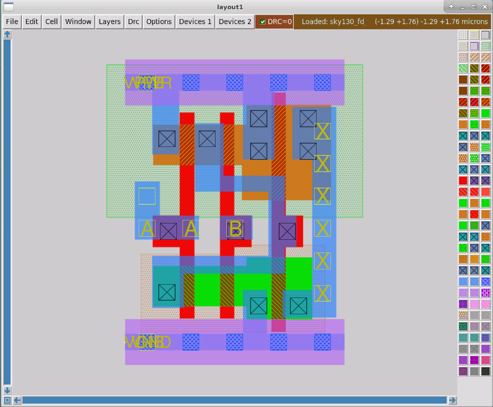
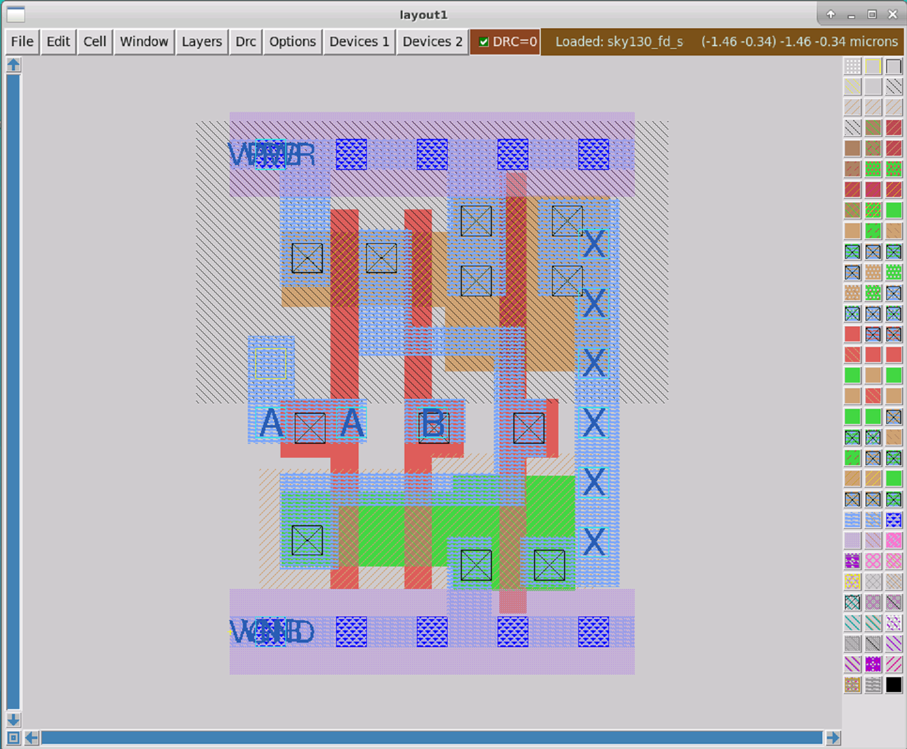

# sky130-physical-verification-workshop

My notes about the physical verification workshop for the SKY130 PDK organized by VSD-IAT in October 2022.

---

## Day 1 Lecture: Introduction to SkyWater SKY130 PDK

Overview of open-source tools, the PDK, layers, devices, etc.

## Day 1 Lab: Tool Installation and Basic DRC/LVS Design Flow

Setup of tools, project folder, etc., create inverter schematic and run spice simulation

### magic


### xschem


### netgen


### ngspice


### Don't repeat myself

To make things more conveniente for myself in the future, I wrote a script to automate the process of setting up a new lab project.

```shell
#!/bin/sh

######################################################################
# project setup, folder structure etc

# Since script can not be made executable on the lab instance,
# it must be sourced, set correct project name before doing so.
project_name=new_project
project_dir=$(pwd)/${project_name}

mkdir -p ${project_dir}
cd ${project_dir}

mkdir mag netgen ngspice xschem

######################################################################
# xschem setup

cd ${project_dir}/xschem
ln -s /usr/share/pdk/sky130A/libs.tech/ngspice/spinit .spiceinit
ln -s /usr/share/pdk/sky130A/libs.tech/xschem/xschemrc xschemrc

######################################################################
# magic setup

cd ${project_dir}/mag
ln -s /usr/share/pdk/sky130A/libs.tech/magic/sky130A.magicrc .magicrc
extract_script=${project_dir}/mag/do_extract.tcl
echo "extract do local" > ${extract_script}
echo "extract all" >> ${extract_script}
echo "ext2spice lvs" >> ${extract_script}
echo "ext2spice" >> ${extract_script}

######################################################################
# netgen setup

cd ${project_dir}/netgen
lvs_subcircuit=${project_name}
# Create example netgen script.
echo 'netgen -batch lvs "../mag/${subcircuit_name} ${subcircuit_name}" "../xschem/${subcircuit_name} ${subcircuit_name}"' > run_lvs.sh
```

Note that the script has to be `source`d inside the shell in case it is not possible to `sudo chmod u+x` the script file.

---

## Day 2 Lecture: Introduction to DRC and LVS

Verification to ensure design is functional.

Design Rule Checking (DRC)
Makes sure the silicon foundry rules are met.

Layout vs Schematic (LVS)
Makes sure the layout matches the design intent as captured by the schematic.
Cross-Checking for equivalence in results derived from independent sources.
Tools checking tools to make sure nothing went wrong along the way.

### Understanding GDS Format

GDSII format, the best we have, but less horrible than the rest.

Before GDSII CIF was used.
Caltech Intermediate Format (CIF), + human readable ASCII, + extensible, - no true grid, - extensible, broken standard

Graphic Design System (GDS), Graphic Design System 2 (GDSII)
layer purpose pairs, GDS layer:purpose int:int, different for each process, non-standard
GDSII is binary, convert to ASCII to read

Layout data: rectangles, polygons, subcells
meta data: labels, cell names, instance names

Some useful scripts in open_pdks/common.

Future file format OASIS, all binary, good for compression.

### Extraction Commands, Styles and Options in Magic

Extraction creates a (SPICE) netlist from a layout, possibly including parasitics.

Magic does from a .mag file extract a .ext file and then converts to .spice
SPICE netlist can be simulated, e.g. with ngspice

Magic extraction:
extract do local
extract all : extract each cell into a .ext file
ext2spice lvs : set sane options for extraction, useful for LVS checking, ensures output format is compatible to ngspice
ext2spice : create .spice file from .ext file

For verification a .spice testbench is needed, where the circuit under test is instantiated.
The device models also need to be included.
Some control statements that provide stimuli to the circuit in the testbench.

Extraction styles in magic are defined in the pdk/sky130/libts.tech/magic/sky130A.tech
Different "styles" e.g. for extract: ngspice() uses defaults, ngspice(si) uses SI units.

### Advanced Extraction Options in Magic

ext2spice lvs : sets number of generally useful/sane options
ext2spice cthresh <value> : sets threshold for parasitic capacitance output. set to "infinite" to supress all capacitances, set to "0" to output all capacitances.
ext2spice scale <on|off> : manages scale option in ext2spice, always off for sky130.
ext2spice hierarchy <on|off> : controls if output contain subcircuits or not, i.e. if a flat or hierarchical spice netlist is created. Recommended "on".
ext2spice subcircuit top <on|off> : control if top level cell is converted to a subcircuit in the output .spice netlist. Requires port labels in layout. Recommended "on", to make layout more self contained.
ext2spice global <on|off> : control behavior for global nets, which end in "!". Highly recommended "off".
ext2spice merge <on|off> : controls if devices with same size are merged in .spice output.

Parasitic capacitances must only capture capacitances which are not part of a device model, e.g. a MiM capacitance is not a parasitic capacitance.

RC Extraction
Extracts parasitic capacitance as well as parasitic resistance.
"extresist all"

Full RC extraction is very disruptive to .spice netlist, netlist will change a lot.

Recommended right now:
extract all
extresist tolerance 10
ext2spice lvs
ext2spice cthresh 0
ext2spice extresist on
ext2spice

### GDS Reading Options in Magic

Magic command "gds" with some options.
"gds read <file>"
"gds readonly <true|false>" needed since magic layers not always correspond to GSDII layers, use do not change PDK library files
"gds flatten true" : flattens small subcells into parent cell if below 10
"gds noduplicates true" : careful, useful to maintain abstract view of loaded cells when loading GDS file which contains the full cell (of the same name).

### GDS Writing, Input/Output Styles and Output Issues

"gds library true" create a GDS library without
"gds addendum true" : ignores read-only cells when writting outputs, avoids duplicate information, but result is not self-contained, since other GDSII file is required.
"gds merge <true|false>" : merges rectangles into polygons, saves space in output faile.

Remember to set the correct input and output style before reading or writing gds files.
"cif istyle sky130()" or "cif istyle sky130(vendor)", the latter is required to read files which are part of the SKY130 PDK due to reasons.
"style rdlimport" : rdl (redistribution layer) needed for bumping.
"style gdsii" 
"style drc"
"style density" : see sky130/custom/scripts/check_density.py
"style wafflefill" : see sky130/custom/scripts/generate_fill.py

### DRC Rules in Magic

Interactive DRC in Magic, marks errors in white pattern.
Different DRC styles in Magic, fast (typical checks, default), full(complete check, slow), routing (checks metal layers only, fastest).
"drc off" can be useful when loading large layout, to avoid lag.
Sometimes DRC errors exist in a cell, which get fixed in the parent cell (up in the hierarchy). This is fine if intended.
No open format to describe DRC errors, all Magic DRC checks are developed for Magic specifically.

Edge-based DRC rules, fast to check spacing, width, surrounds, extends (overlap).
Boolean geometry rules, object-based, second DRC engine in Magic does this, slower.

See open_pdks/sky130/custom/drc

### Extraction Rules and Errors in Magic

Magic tech file contains info about layer height/thickness, can be used to generate 3D view of layout. Useful for parasitic extraction also.

### LVS Setup for Netgen

Layout tool (Magic) does not do LVS. Netgen does LVS, only knows about netlists and how to compare them.
Subcircuits complicate things, e.g. when pins of a resistor can be swapped (permutable).
Figure out that series or parallel devices can be combined and is equivalent to a single device.

See /usr/share/pdk/sky130A/libs.tech/netgen/sky130A_setup.tcl

LVS issues with hierarchy, hierarchy should be same in schematic and layout to make LVS life easier.
LVS may flatten subcircuits to be able to match hierarchy. Flattening can cause big mess.

Netgen can also do Layout vs Verilog (LVV). Verilog can be seen as a netlist format.
Can match SPICE vs Verilog. Verilog should then only contain library cells.
Cannot run LVS down to transistor level, standard cells (considered correct) must be blackboxed.

### Verification by XOR

Compare two layouts by XOR-ing layers/masks. Highlights differences (or changes) between two layouts A and B.

  
## Day 2 Lab: GDS Read/Write, Extraction, DRC, LVS, XOR

List all input styles known to magic:
```shell
% cif listall istyle
sky130(vendor) sky130() rdlimport
```

List input style which is currently active in magic:
```shell
% cif list istyle
sky130(vendor)
```

Load GDS for one of the SKY130 standard cell libraries
```shell
% gds read /usr/share/pdk/sky130A/libs.ref/sky130_fd_sc_hd/gds/sky130_fd_sc_hd.gds
Warning: Calma reading is not undoable!  I hope that's OK.
Library written using GDS-II Release 3.0
Library name: sky130_fd_sc_hd
Reading "sky130_fd_sc_hd__a2111oi_0".
...
Reading "sky130_fd_sc_hd__and2b_1".
```

Get list of available top level cells:
```shell
% cellname top
```
Or use the cell manager menu under Options > Cell Manager.

The AND2 cell layout will be shown.  
The cell ports are shown in yellow, which means they are just text labels, not ports as they should be.  



Read the standard cell library again, but this time with the correct istyle.

```shell
% cif istyle sky130(vendor)
CIF input style is now "sky130(vendor)"
% gds read /usr/share/pdk/sky130A/libs.ref/sky130_fd_sc_hd/gds/sky130_fd_sc_hd.gds
Warning: Calma reading is not undoable!  I hope that's OK.
Library written using GDS-II Release 3.0
Library name: sky130_fd_sc_hd
Reading "sky130_fd_sc_hd__a2111oi_0".
...
Reading "sky130_fd_sc_hd__and2b_1".
Warning:  cell sky130_fd_sc_hd__and2b_1 already existed before reading GDS!
```

The cell ports are shown in dark blue, which means they are correctly identified as ports, as they should be.  


To stop Magic from overwriting existing cells when reading a gds file set the noduplicates option:  

```shell
% gds noduplicates
0
% gds noduplicates true
% gds noduplicates
1
```

Now when reading the same GDS file again, the loaded cells will not be replaced.

```shell
% cif istyle sky130()
Input style sky130(): scaleFactor=2, multiplier=2
CIF input style is now "sky130()"
% gds read /usr/share/pdk/sky130A/libs.ref/sky130_fd_sc_hd/gds/sky130_fd_sc_hd.gds
...
Reading "sky130_fd_sc_hd__and2b_1".
Warning:  cell sky130_fd_sc_hd__and2b_1 already existed before reading GDS!
Using pre-existing cell definition
```

The currently loaded cell is unchanged, as can be seen by the blue color of the cell ports.


Select a port in the cell view and get it's index:

```shell
% port index
3
```

Get the first port in the cell and get more info about it:

```shell
% port first
1
% port 1 name
VPWR
% port 1 class
default
% port 1 use
default
```

To make things a little easier a Tcl proc can be used to print out all ports of the open layout:

```shell
proc report_ports {} {
  set start_idx [port first]
  set stop_idx [port last]
  puts "Index\tName\t\Use\tClass"
  for {set idx $start_idx} {$idx <= $stop_idx} {incr idx} {
    puts "$idx\t[port $idx name]\t[port $idx use]\t[port $idx class]"
  }
}
```

Most of the attributes return 'default' because the GDS file format does not contain meta data like that.
The port indeces are a good example to see how this can cause issues.  
Lets look at the SPICE model for the and2 cell,
```shell
$ nano /usr/share/pdk/sky130A/libs.ref/sky130_fd_sc_hd/spice/sky130_fd_sc_hd.spice
...
.subckt sky130_fd_sc_hd__nand2_1 A B VGND VNB VPB VPWR Y
X0 Y A VPWR VPB sky130_fd_pr__pfet_01v8_hvt w=1e+06u l=150000u
X1 VPWR B Y VPB sky130_fd_pr__pfet_01v8_hvt w=1e+06u l=150000u
X2 VGND B a_113_47# VNB sky130_fd_pr__nfet_01v8 w=650000u l=150000u
X3 a_113_47# A Y VNB sky130_fd_pr__nfet_01v8 w=650000u l=150000u
.ends
...
```

The port index for the output port X in Magic was 3, but in the SPICE model port 3 is assigned to VGND.

Magic can annotate a layout with meta data from LEF and SPICE files. How nice.
When loading a LEF file for a cell Magic usually will load the abstract view for that cell.
However, if a cell layout of the same name is already loaded, Magic will only load the meta data from the LEF file and use that to annotate the loaded cell.

```shell
% lef read /usr/share/pdk/sky130A/libs.ref/sky130_fd_sc_hd/lef/sky130_fd_sc_hd.lef
Reading LEF data from file /usr/share/pdk/sky130A/libs.ref/sky130_fd_sc_hd/lef/sky130_fd_sc_hd.lef.
This action cannot be undone.
LEF read: Processed 68161 lines.
% port 1 name
VPWR
% port 1 use
power
% port 1 class
bidirectional 
```

```shell
% readspice /usr/share/pdk/sky130A/libs.ref/sky130_fd_sc_hd/spice/sky130_fd_sc_hd.spice
...
Annotating cell sky130_fd_sc_hd__inv_4
Selected cell is sky130_fd_sc_hd__inv_4 (Topmost cell in the window)
Cell sky130_fd_sc_hd__inv_4 port order was modified.
% port first
1
% port 1 name
A
```

Now port 1 is the port named A, no longer VPWR as before, which matches the port order in the SPICE model netlist. Port annotation successful.

LEF always is a library and has no concept of a top cell. LEF files are all about placement and routing, no transistors etc.
Some meta data, not other.

In a LEF abstract view everything (metal) that isn't a pin is considered to be an obstruction.

Magic path
```shell
% path
Search path for cells is ". /usr/share/pdk/sky130A/libs.ref/sky130_fd_pr/mag /usr/share/pdk/sky130A/libs.ref/sky130_fd_io/mag /usr/share/pdk/sky130A/libs.ref/sky130_fd_sc_hd/mag /usr/share/pdk/sky130A/libs.ref/sky130_fd_sc_hdll/mag /usr/share/pdk/sky130A/libs.ref/sky130_fd_sc_hs/mag /usr/share/pdk/sky130A/libs.ref/sky130_fd_sc_hvl/mag /usr/share/pdk/sky130A/libs.ref/sky130_fd_sc_lp/mag /usr/share/pdk/sky130A/libs.ref/sky130_fd_sc_ls/mag /usr/share/pdk/sky130A/libs.ref/sky130_fd_sc_ms/mag /usr/share/pdk/sky130A/libs.ref/sky130_osu_sc/mag /usr/share/pdk/sky130A/libs.ref/sky130_osu_sc_t18/mag /usr/share/pdk/sky130A/libs.ref/sky130_ml_xx_hd/mag /usr/share/pdk/sky130A/libs.ref/sky130_sram_macros/mag"
Cell library search path is "/usr/local/lib/magic/sys/current /usr/local/lib/magic/tutorial"
System search path is ". /usr/local/lib/magic/sys /usr/local/lib/magic/sys/current"

% gds write test
   Generating output for cell sky130_fd_sc_hd__and2_1
   Generating output for cell test
select: sky130_fd_sc_hd__and2_1_0
select cell: sky130_fd_sc_hd__and2_1_0
magic::popstack: No subcell stack!

% property
{LEFclass CORE} {LEFsite unithd} {FIXED_BBOX 0 0 460 544} {GDS_FILE $PDKPATH/libs.ref/sky130_fd_sc_hd/gds/sky130_fd_sc_hd.gds} {GDS_START 336980} {GDS_END 341822} {LEFsymmetry X Y R90} {path 0.000 13.600 11.500 13.600 }
```

Create a vendor-like cell
```shell
% gds readonly true
% gds rescale false
% gds read /usr/share/pdk/sky130A/libs.ref/sky130_fd_sc_hd/gds/sky130_fd_sc_hd.gds
...
Reading "sky130_fd_sc_hd__and2b_1".
Loading DRC CIF style.

% load sky130_fd_sc_hd__and2_1
% property
{FIXED_BBOX 0 0 460 544} {GDS_FILE $PDKPATH/libs.ref/sky130_fd_sc_hd/gds/sky130_fd_sc_hd.gds} {GDS_END 341822} {GDS_START 336980} {path 0.000 13.600 11.500 13.600 }
```

Read vendor cell GDS in readonly mode, annotate with LEF, annotate with SPICE, save it to disk. Then compare to original vendor cell.

```shell
% gds readonly true
% gds read /usr/share/...
Reading "sky130_fd_sc_hd__and2b_1".
Loading DRC CIF style.
% port index
3
% port name
X
% port use
default
% port class
default

% lef read /usr/share/pdk/sky130A/libs.ref/sky130_fd_sc_hd/lef/sky130_fd_sc_hd.lef
Reading LEF data from file /usr/share/pdk/sky130A/libs.ref/sky130_fd_sc_hd/lef/sky130_fd_sc_hd.lef.
This action cannot be undone.
LEF read: Processed 68161 lines.
% port name
X
% port use
signal
% port class
output

% readspice /usr/share/pdk/sky130A/libs.ref/sky130_fd_sc_hd/spice/sky130_fd_sc_hd.spice
...
Annotating cell sky130_fd_sc_hd__inv_4
Selected cell is sky130_fd_sc_hd__inv_4 (Topmost cell in the window)
Cell sky130_fd_sc_hd__inv_4 port order was modified.

% port index
7
% port name
X
% port class
output
% port use
signal

# Index of output port X now matches the SPICE model netlist, .subckt sky130_fd_sc_hd__nand2_1 A B VGND VNB VPB VPWR Y
```

TODO
Run SPICE simulation for ideal and2 cell, and2 with parasitic capacitances and and2 with both parasitic capacitances and parasitic resistances.

Running DRC

Magic can do DRC checks, by default the style drc(fast) is used.

```shell
% drc check
% drc style

% drc style drc(full)
% drc check
```

To jump to the next DRC error use 'drc find', to show details about the error use 'drc why'.
```shell
% drc find
% drc why
```

### Layout XOR

To compare two layouts and find differences the layours can be XOR-ed geometrically.
This means that for each layer, the intersecting parts of the two layouts will be removed.
What will remain are only the differences, i.e. things that are only present in layout A but not in layout B or vice versa.

This is a useful tool to highlight and analyse the differences between two layouts.
E.g. after a manual or scripted change was applied, the new layout can be compared the original, to see exactly what has changed.

---

## Day 3 Lecture: Introduction to DRC Rules

Recap of silicon manufacturing process and yield.
All layers should have about the same failure rate, so there is not a single layer responsible for more failures than the rest (reducing the yield). Design rules are not magic numbers, DRC violations MAY produce a working chip, but MAY reduce yield (maybe significantly).
Manufacturers will reject design that do not pass DRC checks.

- Width rules, most basic rule, violation risks e.g. that a wire rips up.
- Spacing rules, violation can risk geometries to short together. No runlength rules in SKY130.
- Wide-spacing rules, higher spacing if a geometry is above a certain size.
- Notch rules, special case of a spacing rule in fact.
- Min/Max area rules, avoid "delamination" (metal area becoming detached), can happen if an area is too small.
- Min hole area rule, only for metal layer(s).
- Contact cuts, for via manufacture, related to ability to maintain mask alignment. Via must be surounded of metal or metal must extent over via.
- Local interconnect rules, uncommon layer, Titanium Nitrate, high-resistance so keep li tracks short (about 100x more R than metal1 Aluminium).
- Off-grid rules, all data must be on a grid of 0.005 um (5 nm) in SKY130.
- Angle rules, usually only 45 or 90 degrees allowed, manhatten style geometries
- Seal ring rules, done by Magic
- Latchup rules, latchup when parasitic pn junction becomes forward biased,not just pn but also pnp and np junctions, can short an entire chip!
  likelyhood of latchup increased when there are not enough taps, diffusion area by definition forms a pn junction.
  Tap rules are a little arbitrary but needed nontheless.
- Antenna rules, needed to avoid electrical device failure due to charge build-up during manufacturing. Caused by long metal tracks which act as antenna, accumulating charge, leading to high voltage, may punch through transistor gates. Requires diodes for discharge. Defined by ratio of metal area to gate area.
- Stress rules, related to metal delamination, avoid metal cracking during sawing and dicing, mechanical stress, wide metal should be perforated with slots to prevent too much mechanical stress to build up "slotted metal". Usually of no concern for a designer working inside the padframe area.
- Density rules, related to flatness of metal layers, to achieve good even polishing results, need e.g. ~ 60% metal density. Automated by magic, done by generate_fill.py and wafflefill.py. Analog designers do not want fill patterns, place fill-block layer.
  Unfortunate routing pitch or metal spacing can prevent fill generation due to spacing rules.
  Density must also not be too high! Designer may need to get rid of metal in some rare situations. E.g. issue in MPW1 with decap cell.
- Recommended rules (RR), makes design more robust, increases yield, mostly meaningless in MPW runs, e.g. redundant vias (at least 2 contact cuts), 
  
Magic does not alway show the exact manufacturing masks, but aims for ease of layout.
This can lead to situation were Magic rules seem to not match up with SKY130 design rules. Need to trust Magic on this.

Usually transistor devices/terminals should contact directly up to metal1.

In SKY130 the tap is a dedicated cell.

Front-End rules
  
Deep n-well isolation, protect devices against noisy substrate. Deep n-well is surounded by regular n-well, large spacing between deep n-wells.

High voltage rules, high voltage implant, SKY130 allows up to 5 ~ 5.5 V, thicker gate oxide for high voltage devices

Resistors from poly (most common), diff or pwell in dn-well. Special contact requirements, handled by Magic automatically.
Recommended to use Magic device generator.
  
Capacitors, varactors, MOScap, Vertical parallel plate (VPP), metal in metal (MiM)
MOScap
VPP (metal-oxide-metal, MOM): stackiong metal layers on top of each other, also interleaved fingers on a metal layer. No reason to use if MiM is available.
MiM: use these instead of VPP if available, larger C per area than VPP, MiM caps can be stacked for even more C per area, must be rectangular, antenna rules.
  
Diodes, on all p-n junctions, mostly parasitic (unwanted), make diode by using correct ID layer.

Some fixed layout devices from foundary which have been characterized, e.g. PNP transistor,
  
Rules for test vs production, for experimental design DRC violation may be unavoidable.

ERC electrical rule check, electromigration, overvoltage, thin high-current wires, 

## Day 3 Lab: DRC rules

---

## Day 4 Lecture: Understanding the PNR and Physical Verification


## Day 4 Lab: No Labs Today 🥳


---

## Day 5 Lecture: Fundamentals of LVS

## Day 5 Lab: LVS
  
---

## References:

[1] https://thesis.library.caltech.edu/1101/1/Whitney_te_1985.pdf  
[2] https://boolean.klassholwerda.nl/interface/bnf/gdsformat.html (site down)  
[3] https://antmicro-skywater-pdk-docs.readthedocs.io/en/latest/rules.html
[4] https://wikipedia.org, I guess ... why not? 
