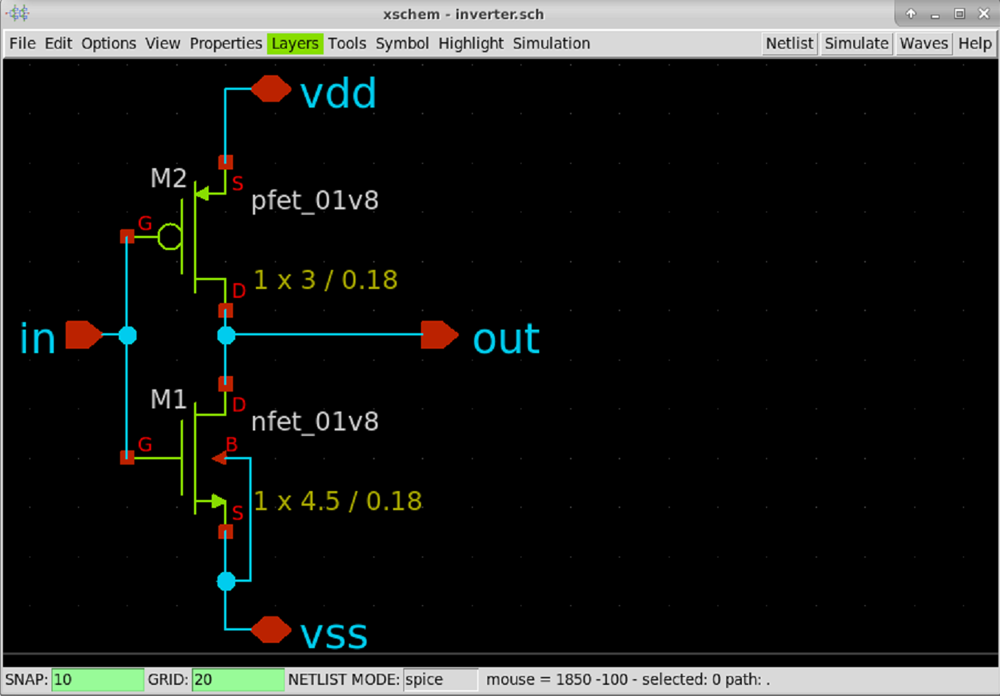
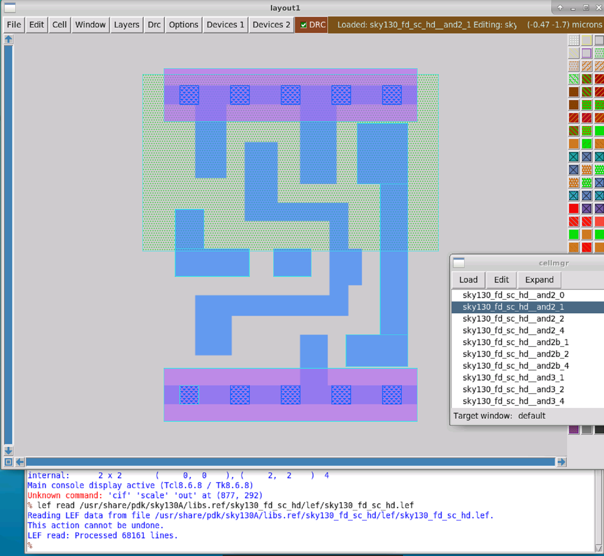
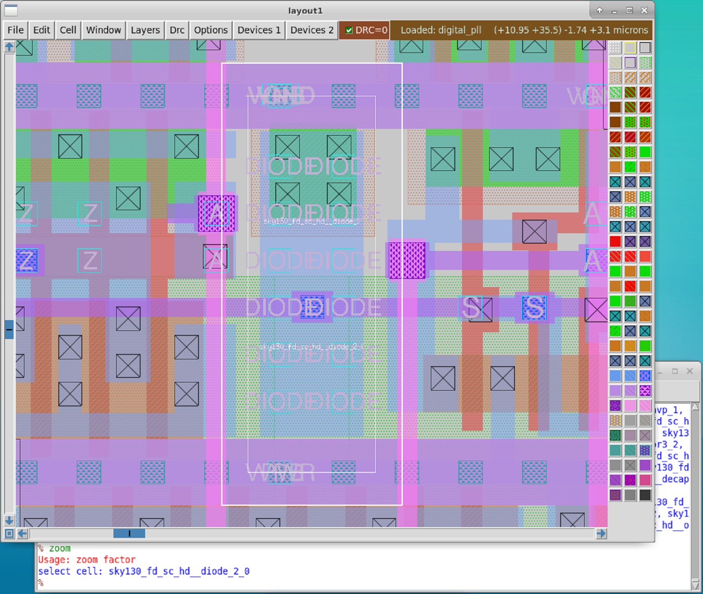
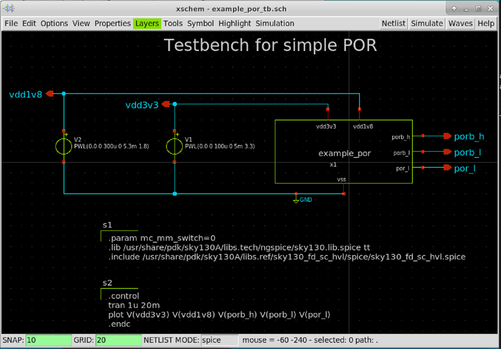

# sky130-physical-verification-workshop

My notes about the physical verification workshop for the SKY130 PDK organized by VSD-IAT in October 2022.

---

## Day 1 Lecture: Introduction to SkyWater SKY130 PDK

Overview of open-source tools, the PDK, layers, devices, etc.

### Magic

Magic is a open-source VLSI layout tool [1].
Magic can perform DRC checking, netlist extraction and more.
Magic comes with a integrated Tcl interpreter.

In the project dir, create a folder for Magic and set up links to the magicrc file from the PDK. This sets up Magic for use with the SKY130 PDK.

```shell
$ mkdir -p mag
$ cd ./mag
$ ln -s /usr/share/pdk/sky130A/libs.tech/magic/magicrc .magicrc
```


### Xschem

Xschem is a open-source schematic capture tool for drawing digital and analog electronic circuits.
Xschem can generate SPICE netlists in different flavors and for variaous purposes.

In the project dir, create a folder for Xschem and set up links to the xschemrc and spinit files from the PDK. This sets up Xschem for use with the SKY130 PDK.


```shell
$ mkdir -p mag
$ cd ./mag
ln -s /usr/share/pdk/sky130A/libs.tech/ngspice/spinit .spiceinit
‌ln -s /usr/share/pdk/sky130A/libs.tech/xschem/xschemrc xschemrc
```


### Netgen

Netgen is a open-source netlist equivalence checking tool.
Netgen can be used for layout vs. schematic (LVS) checking to find differences
between a schematic netlist and a netlist extracted from a related layout.
It can handle many difference netlist formats and is controlled from a integrated Tcl interpreter.


### Ngspice

Ngspice is a open-source SPICE simulator. There are other options, but this one works just as well. It has a integrated Tcl interpreter, which should come at no surprise at this point.


### Don't repeat myself

To make things more conveniente for myself in the future, I wrote a script to automate the process of setting up a new lab project.

```shell
#!/bin/sh

######################################################################
# project setup, folder structure etc

# Since script can not be made executable on the lab instance,
# it must be sourced, set correct project name before doing so.
project_name=new_project
project_dir=$(pwd)/${project_name}

mkdir -p ${project_dir}
cd ${project_dir}

mkdir mag netgen ngspice xschem

######################################################################
# xschem setup

cd ${project_dir}/xschem
ln -s /usr/share/pdk/sky130A/libs.tech/ngspice/spinit .spiceinit
ln -s /usr/share/pdk/sky130A/libs.tech/xschem/xschemrc xschemrc

######################################################################
# magic setup

cd ${project_dir}/mag
ln -s /usr/share/pdk/sky130A/libs.tech/magic/sky130A.magicrc .magicrc
extract_script=${project_dir}/mag/do_extract.tcl
echo "extract do local" > ${extract_script}
echo "extract all" >> ${extract_script}
echo "ext2spice lvs" >> ${extract_script}
echo "ext2spice" >> ${extract_script}

######################################################################
# netgen setup

cd ${project_dir}/netgen
lvs_subcircuit=${project_name}
# Create example netgen script.
echo 'netgen -batch lvs "../mag/${subcircuit_name} ${subcircuit_name}" "../xschem/${subcircuit_name} ${subcircuit_name}"' > run_lvs.sh
```

Note that the script has to be `source`d inside the shell in case it is not possible to `sudo chmod u+x` the script file.

---

## Day 1 Lab: Tool Installation and Basic DRC/LVS Design Flow

On the first day we learn how to set up the tools, the project folder, setup scripts, and so on.

As an introductoy example we create a inverter schematic and run spice simulation.

Create the inverter schematic in xschem by placing symbols for one nfet, one pfet, one ipin, one opin and two iopins. Connect all symbols correctly to get an inverter.
Create a symbol for the inverter schematic, which can be used to instantiate the inverter as a subcircuit into another schematic, e.g. the testbench.
Extract the netlist, but make sure to select "top level as subcircuit" from the simulation menu before writing the netlist.


Create a new schematic for the testbench of the inverter.
Place one inverter symbol, which was created previously.
Add one voltage source which get connected to the power supply pins of the inverter.
Add another voltage source which generated the stimulus input to the inverter for transient simulation.
Add a ground symbol and connect it appropriately.
Add two SPICE code blocks.
The first one does include the device library from the SKY130 PDK.
The second one does hold the commands to run a transient simulation.
Extract the netlist


Now go to the `./mag` subfolder and launch Magic.
Import the inverter netlist which was created before.
The Magic layout will show the parameterized devices and ports from the netlist.
All that needs to be done is place them and connect them correctly.


Finally extract the netlist from the Magic layout.
This command sequence will be used a lot, best to memorize it or create a Tcl proc which does the same.

```shell
# From the Magic Tcl schell
% extract do local
% extract all
% ext2spice lvs
% ext2spice
```

Now copy the extracted netlist to the xschem directory and run the simulation again, using the extracted netlist from layout for the inverter.


As a final step netgen can be run to verify that layout and schematic match.
More on this in a later exercise.

```shell
netgen -batch lvs "../mag/inverter.spice inverter" "../xschem/inverter.spice inverter"
```

Looks good.

## Day 2 Lecture: Introduction to DRC and LVS

Verification to ensure design is functional.

Design Rule Checking (DRC)
Makes sure the silicon foundry rules are met.

Layout vs Schematic (LVS)
Makes sure the layout matches the design intent as captured by the schematic.
Cross-Checking for equivalence in results derived from independent sources.
Tools checking tools to make sure nothing went wrong along the way.

### Understanding GDS Format

GDSII format, the best we have, but less horrible than the rest.

Before GDSII CIF was used.
Caltech Intermediate Format (CIF), + human readable ASCII, + extensible, - no true grid, - extensible, broken standard

Graphic Design System (GDS), Graphic Design System 2 (GDSII)
layer purpose pairs, GDS layer:purpose int:int, different for each process, non-standard
GDSII is binary, convert to ASCII to read

Layout data: rectangles, polygons, subcells
meta data: labels, cell names, instance names

Some useful scripts in open_pdks/common.

Future file format OASIS, all binary, good for compression.

### Extraction Commands, Styles and Options in Magic

Extraction creates a (SPICE) netlist from a layout, possibly including parasitics.

Magic does from a .mag file extract a .ext file and then converts to .spice
SPICE netlist can be simulated, e.g. with ngspice

Magic extraction:
extract do local
extract all : extract each cell into a .ext file
ext2spice lvs : set sane options for extraction, useful for LVS checking, ensures output format is compatible to ngspice
ext2spice : create .spice file from .ext file

For verification a .spice testbench is needed, where the circuit under test is instantiated.
The device models also need to be included.
Some control statements that provide stimuli to the circuit in the testbench.

Extraction styles in magic are defined in the pdk/sky130/libts.tech/magic/sky130A.tech
Different "styles" e.g. for extract: ngspice() uses defaults, ngspice(si) uses SI units.

### Advanced Extraction Options in Magic

ext2spice lvs : sets number of generally useful/sane options
ext2spice cthresh <value> : sets threshold for parasitic capacitance output. set to "infinite" to supress all capacitances, set to "0" to output all capacitances.
ext2spice scale <on|off> : manages scale option in ext2spice, always off for sky130.
ext2spice hierarchy <on|off> : controls if output contain subcircuits or not, i.e. if a flat or hierarchical spice netlist is created. Recommended "on".
ext2spice subcircuit top <on|off> : control if top level cell is converted to a subcircuit in the output .spice netlist. Requires port labels in layout. Recommended "on", to make layout more self contained.
ext2spice global <on|off> : control behavior for global nets, which end in "!". Highly recommended "off".
ext2spice merge <on|off> : controls if devices with same size are merged in .spice output.

Parasitic capacitances must only capture capacitances which are not part of a device model, e.g. a MiM capacitance is not a parasitic capacitance.

RC Extraction
Extracts parasitic capacitance as well as parasitic resistance.
"extresist all"

Full RC extraction is very disruptive to .spice netlist, netlist will change a lot.

Recommended right now:
extract all
extresist tolerance 10
ext2spice lvs
ext2spice cthresh 0
ext2spice extresist on
ext2spice

### GDS Reading Options in Magic

Magic command "gds" with some options.
"gds read <file>"
"gds readonly <true|false>" needed since magic layers not always correspond to GSDII layers, use do not change PDK library files
"gds flatten true" : flattens small subcells into parent cell if below 10
"gds noduplicates true" : careful, useful to maintain abstract view of loaded cells when loading GDS file which contains the full cell (of the same name).

### GDS Writing, Input/Output Styles and Output Issues

"gds library true" create a GDS library without
"gds addendum true" : ignores read-only cells when writting outputs, avoids duplicate information, but result is not self-contained, since other GDSII file is required.
"gds merge <true|false>" : merges rectangles into polygons, saves space in output faile.

Remember to set the correct input and output style before reading or writing gds files.
"cif istyle sky130()" or "cif istyle sky130(vendor)", the latter is required to read files which are part of the SKY130 PDK due to reasons.
"style rdlimport" : rdl (redistribution layer) needed for bumping.
"style gdsii" 
"style drc"
"style density" : see sky130/custom/scripts/check_density.py
"style wafflefill" : see sky130/custom/scripts/generate_fill.py

### DRC Rules in Magic

Interactive DRC in Magic, marks errors in white pattern.
Different DRC styles in Magic, fast (typical checks, default), full(complete check, slow), routing (checks metal layers only, fastest).
"drc off" can be useful when loading large layout, to avoid lag.
Sometimes DRC errors exist in a cell, which get fixed in the parent cell (up in the hierarchy). This is fine if intended.
No open format to describe DRC errors, all Magic DRC checks are developed for Magic specifically.

Edge-based DRC rules, fast to check spacing, width, surrounds, extends (overlap).
Boolean geometry rules, object-based, second DRC engine in Magic does this, slower.

See open_pdks/sky130/custom/drc

### Extraction Rules and Errors in Magic

Magic tech file contains info about layer height/thickness, can be used to generate 3D view of layout. Useful for parasitic extraction also.

### LVS Setup for Netgen

Layout tool (Magic) does not do LVS. Netgen does LVS, only knows about netlists and how to compare them.
Subcircuits complicate things, e.g. when pins of a resistor can be swapped (permutable).
Figure out that series or parallel devices can be combined and is equivalent to a single device.

See /usr/share/pdk/sky130A/libs.tech/netgen/sky130A_setup.tcl

LVS issues with hierarchy, hierarchy should be same in schematic and layout to make LVS life easier.
LVS may flatten subcircuits to be able to match hierarchy. Flattening can cause big mess.

Netgen can also do Layout vs Verilog (LVV). Verilog can be seen as a netlist format.
Can match SPICE vs Verilog. Verilog should then only contain library cells.
Cannot run LVS down to transistor level, standard cells (considered correct) must be blackboxed.

### Verification by XOR

Compare two layouts by XOR-ing layers/masks. Highlights differences (or changes) between two layouts A and B.

  
## Day 2 Lab: GDS Read/Write, Extraction, DRC, LVS, XOR

List all input styles known to magic:
```shell
% cif listall istyle
sky130(vendor) sky130() rdlimport
```

List input style which is currently active in magic:
```shell
% cif list istyle
sky130(vendor)
```

Load GDS for one of the SKY130 standard cell libraries
```shell
% gds read /usr/share/pdk/sky130A/libs.ref/sky130_fd_sc_hd/gds/sky130_fd_sc_hd.gds
Warning: Calma reading is not undoable!  I hope that's OK.
Library written using GDS-II Release 3.0
Library name: sky130_fd_sc_hd
Reading "sky130_fd_sc_hd__a2111oi_0".
...
Reading "sky130_fd_sc_hd__and2b_1".
```

Get list of available top level cells:
```shell
% cellname top
```
Or use the cell manager menu under Options > Cell Manager.


The AND2 cell layout will be shown.  
The cell ports are shown in yellow, which means they are just text labels, not ports as they should be.  


Read the standard cell library again, but this time with the correct istyle.

```shell
% cif istyle sky130(vendor)
CIF input style is now "sky130(vendor)"
% gds read /usr/share/pdk/sky130A/libs.ref/sky130_fd_sc_hd/gds/sky130_fd_sc_hd.gds
Warning: Calma reading is not undoable!  I hope that's OK.
Library written using GDS-II Release 3.0
Library name: sky130_fd_sc_hd
Reading "sky130_fd_sc_hd__a2111oi_0".
...
Reading "sky130_fd_sc_hd__and2b_1".
Warning:  cell sky130_fd_sc_hd__and2b_1 already existed before reading GDS!
```

The cell ports are shown in dark blue, which means they are correctly identified as ports, as they should be.  


To stop Magic from overwriting existing cells when reading a gds file set the noduplicates option:  

```shell
% gds noduplicates
0
% gds noduplicates true
% gds noduplicates
1
```

Now when reading the same GDS file again, the loaded cells will not be replaced.

```shell
% cif istyle sky130()
Input style sky130(): scaleFactor=2, multiplier=2
CIF input style is now "sky130()"
% gds read /usr/share/pdk/sky130A/libs.ref/sky130_fd_sc_hd/gds/sky130_fd_sc_hd.gds
...
Reading "sky130_fd_sc_hd__and2b_1".
Warning:  cell sky130_fd_sc_hd__and2b_1 already existed before reading GDS!
Using pre-existing cell definition
```

The currently loaded cell is unchanged, as can be seen by the blue color of the cell ports.


Select a port in the cell view and get it's index:

```shell
% port index
3
```


Get the first port in the cell and get more info about it:

```shell
% port first
1
% port 1 name
VPWR
% port 1 class
default
% port 1 use
default
```

To make things a little easier a Tcl proc can be used to print out all ports of the open layout:

```shell
proc report_ports {} {
  set start_idx [port first]
  set stop_idx [port last]
  puts "Index\tName\t\Use\tClass"
  for {set idx $start_idx} {$idx <= $stop_idx} {incr idx} {
    puts "$idx\t[port $idx name]\t[port $idx use]\t[port $idx class]"
  }
}
```

Most of the attributes return 'default' because the GDS file format does not contain meta data like that.
The port indeces are a good example to see how this can cause issues.  
Lets look at the SPICE model for the and2 cell,
```shell
$ nano /usr/share/pdk/sky130A/libs.ref/sky130_fd_sc_hd/spice/sky130_fd_sc_hd.spice
...
.subckt sky130_fd_sc_hd__nand2_1 A B VGND VNB VPB VPWR Y
X0 Y A VPWR VPB sky130_fd_pr__pfet_01v8_hvt w=1e+06u l=150000u
X1 VPWR B Y VPB sky130_fd_pr__pfet_01v8_hvt w=1e+06u l=150000u
X2 VGND B a_113_47# VNB sky130_fd_pr__nfet_01v8 w=650000u l=150000u
X3 a_113_47# A Y VNB sky130_fd_pr__nfet_01v8 w=650000u l=150000u
.ends
...
```

The port index for the output port X in Magic was 3, but in the SPICE model port 3 is assigned to VGND.

Magic can annotate a layout with meta data from LEF and SPICE files. How nice.
When loading a LEF file for a cell Magic usually will load the abstract view for that cell.
However, if a cell layout of the same name is already loaded, Magic will only load the meta data from the LEF file and use that to annotate the loaded cell.

```shell
% lef read /usr/share/pdk/sky130A/libs.ref/sky130_fd_sc_hd/lef/sky130_fd_sc_hd.lef
Reading LEF data from file /usr/share/pdk/sky130A/libs.ref/sky130_fd_sc_hd/lef/sky130_fd_sc_hd.lef.
This action cannot be undone.
LEF read: Processed 68161 lines.
% port 1 name
VPWR
% port 1 use
power
% port 1 class
bidirectional 
```

```shell
% readspice /usr/share/pdk/sky130A/libs.ref/sky130_fd_sc_hd/spice/sky130_fd_sc_hd.spice
...
Annotating cell sky130_fd_sc_hd__inv_4
Selected cell is sky130_fd_sc_hd__inv_4 (Topmost cell in the window)
Cell sky130_fd_sc_hd__inv_4 port order was modified.
% port first
1
% port 1 name
A
```

Now port 1 is the port named A, no longer VPWR as before, which matches the port order in the SPICE model netlist. Port annotation successful.

LEF always is a library and has no concept of a top cell. LEF files are all about placement and routing, no transistors etc.
Some meta data, not other.


The abstract view of the and2_1 cell from the LEF file.



In a LEF abstract view everything (metal) that isn't a pin is considered to be an obstruction.

Magic path
```shell
% path
Search path for cells is ". /usr/share/pdk/sky130A/libs.ref/sky130_fd_pr/mag /usr/share/pdk/sky130A/libs.ref/sky130_fd_io/mag /usr/share/pdk/sky130A/libs.ref/sky130_fd_sc_hd/mag /usr/share/pdk/sky130A/libs.ref/sky130_fd_sc_hdll/mag /usr/share/pdk/sky130A/libs.ref/sky130_fd_sc_hs/mag /usr/share/pdk/sky130A/libs.ref/sky130_fd_sc_hvl/mag /usr/share/pdk/sky130A/libs.ref/sky130_fd_sc_lp/mag /usr/share/pdk/sky130A/libs.ref/sky130_fd_sc_ls/mag /usr/share/pdk/sky130A/libs.ref/sky130_fd_sc_ms/mag /usr/share/pdk/sky130A/libs.ref/sky130_osu_sc/mag /usr/share/pdk/sky130A/libs.ref/sky130_osu_sc_t18/mag /usr/share/pdk/sky130A/libs.ref/sky130_ml_xx_hd/mag /usr/share/pdk/sky130A/libs.ref/sky130_sram_macros/mag"
Cell library search path is "/usr/local/lib/magic/sys/current /usr/local/lib/magic/tutorial"
System search path is ". /usr/local/lib/magic/sys /usr/local/lib/magic/sys/current"

% gds write test
   Generating output for cell sky130_fd_sc_hd__and2_1
   Generating output for cell test
select: sky130_fd_sc_hd__and2_1_0
select cell: sky130_fd_sc_hd__and2_1_0
magic::popstack: No subcell stack!

% property
{LEFclass CORE} {LEFsite unithd} {FIXED_BBOX 0 0 460 544} {GDS_FILE $PDKPATH/libs.ref/sky130_fd_sc_hd/gds/sky130_fd_sc_hd.gds} {GDS_START 336980} {GDS_END 341822} {LEFsymmetry X Y R90} {path 0.000 13.600 11.500 13.600 }
```

Create a vendor-like cell
```shell
% gds readonly true
% gds rescale false
% gds read /usr/share/pdk/sky130A/libs.ref/sky130_fd_sc_hd/gds/sky130_fd_sc_hd.gds
...
Reading "sky130_fd_sc_hd__and2b_1".
Loading DRC CIF style.

% load sky130_fd_sc_hd__and2_1
% property
{FIXED_BBOX 0 0 460 544} {GDS_FILE $PDKPATH/libs.ref/sky130_fd_sc_hd/gds/sky130_fd_sc_hd.gds} {GDS_END 341822} {GDS_START 336980} {path 0.000 13.600 11.500 13.600 }
```

Read vendor cell GDS in readonly mode, annotate with LEF, annotate with SPICE, save it to disk. Then compare to original vendor cell.

```shell
% gds readonly true
% gds read /usr/share/...
Reading "sky130_fd_sc_hd__and2b_1".
Loading DRC CIF style.
% port index
3
% port name
X
% port use
default
% port class
default

% lef read /usr/share/pdk/sky130A/libs.ref/sky130_fd_sc_hd/lef/sky130_fd_sc_hd.lef
Reading LEF data from file /usr/share/pdk/sky130A/libs.ref/sky130_fd_sc_hd/lef/sky130_fd_sc_hd.lef.
This action cannot be undone.
LEF read: Processed 68161 lines.
% port name
X
% port use
signal
% port class
output

% readspice /usr/share/pdk/sky130A/libs.ref/sky130_fd_sc_hd/spice/sky130_fd_sc_hd.spice
...
Annotating cell sky130_fd_sc_hd__inv_4
Selected cell is sky130_fd_sc_hd__inv_4 (Topmost cell in the window)
Cell sky130_fd_sc_hd__inv_4 port order was modified.

% port index
7
% port name
X
% port class
output
% port use
signal

# Index of output port X now matches the SPICE model netlist, .subckt sky130_fd_sc_hd__nand2_1 A B VGND VNB VPB VPWR Y
```

Run SPICE simulation for ideal and2 cell, and2 with parasitic capacitances and and2 with both parasitic capacitances and parasitic resistances.

Running DRC

Magic can do DRC checks, by default the style drc(fast) is used.

```shell
% drc check
% drc style

% drc style drc(full)
% drc check
```


To jump to the next DRC error use 'drc find', to show details about the error use 'drc why'.
```shell
% drc find
% drc why
```

Adding a tap cell does fix the error.


### Layout XOR

To compare two layouts and find differences the layours can be XOR-ed geometrically.
This means that for each layer, the intersecting parts of the two layouts will be removed.
What will remain are only the differences, i.e. things that are only present in layout A but not in layout B or vice versa.


This is a useful tool to highlight and analyse the differences between two layouts.
E.g. after a manual or scripted change was applied, the new layout can be compared the original, to see exactly what has changed.

This is how the XOR result will look like if a cell is slightly shifted in one layout compared to the other layout.


---

## Day 3 Lecture: Introduction to DRC Rules

Recap of silicon manufacturing process and yield.
All layers should have about the same failure rate, so there is not a single layer responsible for more failures than the rest (reducing the yield). Design rules are not magic numbers, DRC violations MAY produce a working chip, but MAY reduce yield (maybe significantly).
Manufacturers will reject design that do not pass DRC checks.

- Width rules, most basic rule, violation risks e.g. that a wire rips up.
- Spacing rules, violation can risk geometries to short together. No runlength rules in SKY130.
- Wide-spacing rules, higher spacing if a geometry is above a certain size.
- Notch rules, special case of a spacing rule in fact.
- Min/Max area rules, avoid "delamination" (metal area becoming detached), can happen if an area is too small.
- Min hole area rule, only for metal layer(s).
- Contact cuts, for via manufacture, related to ability to maintain mask alignment. Via must be surounded of metal or metal must extent over via.
- Local interconnect rules, uncommon layer, Titanium Nitrate, high-resistance so keep li tracks short (about 100x more R than metal1 Aluminium).
- Off-grid rules, all data must be on a grid of 0.005 um (5 nm) in SKY130.
- Angle rules, usually only 45 or 90 degrees allowed, manhatten style geometries
- Seal ring rules, done by Magic
- Latchup rules, latchup when parasitic pn junction becomes forward biased,not just pn but also pnp and np junctions, can short an entire chip!
  likelyhood of latchup increased when there are not enough taps, diffusion area by definition forms a pn junction.
  Tap rules are a little arbitrary but needed nontheless.
- Antenna rules, needed to avoid electrical device failure due to charge build-up during manufacturing. Caused by long metal tracks which act as antenna, accumulating charge, leading to high voltage, may punch through transistor gates. Requires diodes for discharge. Defined by ratio of metal area to gate area.
- Stress rules, related to metal delamination, avoid metal cracking during sawing and dicing, mechanical stress, wide metal should be perforated with slots to prevent too much mechanical stress to build up "slotted metal". Usually of no concern for a designer working inside the padframe area.
- Density rules, related to flatness of metal layers, to achieve good even polishing results, need e.g. ~ 60% metal density. Automated by magic, done by generate_fill.py and wafflefill.py. Analog designers do not want fill patterns, place fill-block layer.
  Unfortunate routing pitch or metal spacing can prevent fill generation due to spacing rules.
  Density must also not be too high! Designer may need to get rid of metal in some rare situations. E.g. issue in MPW1 with decap cell.
- Recommended rules (RR), makes design more robust, increases yield, mostly meaningless in MPW runs, e.g. redundant vias (at least 2 contact cuts), 
  
Magic does not alway show the exact manufacturing masks, but aims for ease of layout.
This can lead to situation were Magic rules seem to not match up with SKY130 design rules. Need to trust Magic on this.

Usually transistor devices/terminals should contact directly up to metal1.

In SKY130 the tap is a dedicated cell.

Front-End rules
  
Deep n-well isolation, protect devices against noisy substrate. Deep n-well is surounded by regular n-well, large spacing between deep n-wells.

High voltage rules, high voltage implant, SKY130 allows up to 5 ~ 5.5 V, thicker gate oxide for high voltage devices

Resistors from poly (most common), diff or pwell in dn-well. Special contact requirements, handled by Magic automatically.
Recommended to use Magic device generator.
  
Capacitors, varactors, MOScap, Vertical parallel plate (VPP), metal in metal (MiM)
MOScap
VPP (metal-oxide-metal, MOM): stackiong metal layers on top of each other, also interleaved fingers on a metal layer. No reason to use if MiM is available.
MiM: use these instead of VPP if available, larger C per area than VPP, MiM caps can be stacked for even more C per area, must be rectangular, antenna rules.
  
Diodes, on all p-n junctions, mostly parasitic (unwanted), make diode by using correct ID layer.

Some fixed layout devices from foundary which have been characterized, e.g. PNP transistor,
  
Rules for test vs production, for experimental design DRC violation may be unavoidable.

ERC electrical rule check, electromigration, overvoltage, thin high-current wires, 

## Day 3 Lab: DRC rules

Begin by cloning the github repository used for the lab exercises.

```shell
$ git clone https://github.com/RTimothyEdwards/vsd_drc_lab.git
Cloning into 'vsd_drc_lab'...
remote: Enumerating objects: 51, done.
remote: Counting objects: 100% (51/51), done.
remote: Compressing objects: 100% (40/40), done.
remote: Total 51 (delta 13), reused 48 (delta 10), pack-reused 0
Unpacking objects: 100% (51/51), done.

$ cd vsd_drc_lab/
ls
LICENSE     exercise_1.mag   exercise_12.mag  exercise_4.mag  exercise_7.mag  gds_magic   run_magic
README	    exercise_10.mag  exercise_2.mag   exercise_5.mag  exercise_8.mag  paramcells  via_a.mag
angled.mag  exercise_11.mag  exercise_3.mag   exercise_6.mag  exercise_9.mag  polys.mag   via_b.mag

$ ./run_magic 
```

### Exercise 1 (L1): Width and Spacing Rules

In this lab exercise a number of layouts are presented which contain examples
of DRC violations.

```shell
$ ./run_magic

% load exercise_1.mag
% drc find
```

<table>
<tr>
<td></td>
<td></td>
<td></td>
</tr>
<tr>
<td></td>
<td></td>
<td></td>
</tr>
<tr>
<td></td>
</tr>
</table>

<table>
<tr>
<td></td>
<td></td>
<td></td>
</tr>
<tr>
<td></td>
<td></td>
<td></td>
</tr>
<tr>
<td></td>
</tr>
</table>

### Exercise 2 (L2): Wide Spacing and Notch Rules

```shell
$ ./run_magic

% load exercise_2.mag

% cif see xxx
CIF name "xxx" doesnt exist in style "gdsii".
The valid CIF layer names are: CELLBOUND, BOUND, DNWELL, PWRES, SUBCUT, NWELL, WELLTXT, WELLPIN, SUBTXT, SUBPIN, DIFF, DIFFTXT, DIFFPIN, TAP, TAPTXT, FOMFILL, basePSDM, baseNSDM, extendPSDM, PSDM, extendNSDM, NSDM, LVID, LVTN, HVTR, HVTP, SONOS, COREID, STDCELL, ESDID, NPNID, pnparea, PNPID, RPM, URPM, LDNTM, hvntm_block, HVNTM, POLY, POLYTXT, POLYPIN, POLYFILL, thkox_area, large_ptap_mv, small_ptap_mv, HVI, CONT, xpc_horiz, CONT, CONT, diffcutarea, NPC, NPC, DIFFRES, POLYRES, POLYSHORT, POLYRES, DIODE, LI, LITXT, LIPIN, LIRES, LIFILL, MCON, MET1, MET1TXT, MET1PIN, MET1RES, MET1FILL, VIA1, MET2, MET2TXT, MET2PIN, MET2RES, MET2FILL, VIA2, MET3, MET3TXT, MET3PIN, MET3RES, MET3FILL, VIA3, MET4, MET4TXT, MET4PIN, MET4RES, MET4FILL, VIA4, MET5, MET5TXT, MET5PIN, MET5RES, MET5FILL, RDL, RDLTXT, RDLPIN, PI1, UBM, PI2, GLASS, CAPM, CAPM2, LOWTAPDENSITY, FILLOBSFOM, FILLOBSM1, FILLOBSM2, FILLOBSM3, FILLOBSM4.

% feedback why

% feedback clear
```


<table>
<tr>
<td></td>
<td></td>
<td></td>
</tr>
<tr>
<td></td>
<td></td>
<td></td>
</tr>
<tr>
<td></td>
<td></td>
</tr>
</table>


### Exercise 2 (L3): Via Size, Multiple Vias, Via Overlap and Autogenerated Vias

```shell
$ ./run_magic

% load exercise_2.mag

# Exercise 2b
% box grow c 0.03um

# Exercise 2c
% box grow e 0.03um
% box grow w 0.03um

# Exercise 2d
# Hit space bar to cycle through mouse tools, until the wiring tool is selected.
# Left click to route, right click to auto-place a via upwards,
# shift+right-click to auto-place a via downwards.
# Note that metal width is automatically increased to meet minimum
# width requirements when rising up a layer, but does not decrease automatically when decending a layer.
```


<table>
<tr>
<td></td>
<td></td>
<td></td>
</tr>
<tr>
<td></td>
<td></td>
<td></td>
</tr>
</table>


### Exercise 3 (L4): Minimum Area and Minimum Hole Rules

```shell
$ ./run_magic

$ load exercise_3.mag

```


<table>
<tr>
<td></td>
<td></td>
<td></td>
</tr>
<tr>
<td></td>
<td></td>
</tr>
</table>

### Exercise 5: Wells and Deep N-Well

### Exercise 6: Derived Layers

### Exercise 7: Parameterized and PDK Devices

### Exercise 8: Angle Error and Overlap Rules

### Exercise 9: Unimplemented Rules

### Exercise 10: Latch-Up and Antenna Rules

### Exercise 11: Density Rules

---

## Day 4 Lecture: Understanding the PNR and Physical Verification

### OpenLANE Flow

Synthesis is done by yosys + abc, RTL -> gate-level netlist

OpenSTA for static timing analysis, uses ideal clocks.

Floorplanning, port placement, inserts welltaps and decaps, power distribution network (PDN)

Placement, global and detail placement.

Clock tree synthesis (CTS), using Triton TCS, STA using real clocks.

Routing, FastRoute, fill instertion done afterwards.

Antenna diode insertion, parameter DIODE_INSERTION_STRATEGY, values 1..5

Detail routing, does signal reouting, results in DEF file with routed design.

RC extraction, done by Magic, followed by STA to check timing.

Physical verification, Magic does DRC checks and antenna checks, klayout also does DRC checks, netgen does LVS checks, finally circuit validity checks (CVC).

GDSII generation, done by Magic or klayout.

Config.tcl is paramount for OpenLANE flow, controls the flow.
Contains all parameters needed.

### RTL2GDS for Demo Design

```shell
# Launch OpenLANE docker container with the current work directory mounted into the container.
$ make mount
# We end up in another Tcl shell ... great!
% flow.tcl
...
lots of output
...
[SUCCESS] Flow Completed Without Fatal Errors.
# Done, time to look at the results
```

Exit docker and run magic, then open the example design GDSII.
Press x to expand all cells, so it looks all nice and colorful.


### Interactive OpenLANE Run

Walk through the flow step by step, same as before in the non-interactive flow, but pauses in between.
The user can inspect the intermediate result and tweak flow parameters to get the desired QoR.

```shell
# Export the PDK_ROOT if not already done in ~/.bashrc
$ export PDK_ROOT=/usr/share/pdk
$ make mount
$ flow.tcl -interactive
% package require openlane
0.9
% prep -design spm -tag workshop1
...
% run_synthesis
...
% run_floorplan
...
% run_placement
...
% run_cts # insert clock distribution tree
...
% run_resizer_timing # resize clock buffers to improve slack
...
% run_routing
...
% write_powered_verilog # used to do LVS check
...
% set_netlist $::env(lvs_result_file_tag).powered.v
..
% run_magic # will create final gds file, lef etc
...
% run_klayout # generate gds with klayout and cross-check against magic
...
% run_klayout_gds_xor # XOR klayout gds with magic gds, expected empty result (no differences)
...
% run_magic_spice_export
...
% run_lvs
...
% run_magic_drc
...
% run_antenna_check
...
% run_lef_cvc
...
% generate_final_summary_report
...
# Final report should show 0 DRC violations, 0 LVS errors and 0 antenna violations.
```

### Techniques to Avoid Common DRC Errors

Avoid long local interconnect tracks. No routing, only within a cell.

#### Density planning

Utilization ratio = total area / occupied area, default target 0.5
Cell density, default 0.55, lower density eases routing, increases area required

Dont use cells, a list of cells to be avoided by OpenLANE, known to cause problems, can be found at /usr/share/pdk/sky130A/libs.tech/openlane/std_cell_LIB/drc_exclude.cells

Download git repo for lab (wtf no party today?)
```shell
$ git clone https://github.com/an3ol/PV-Workshop
...
$ cp PV-Workshop/task1 ~/workspace/task1
$ cp PV-Workshop/task2 ~/workspace/task2

$ export PDK_ROOT=/usr/share/pdk
$ make mount
$ ./flow.tcl -design task1 -tag workshop_task1
...
# should get lots of drc + lvs errors
```

Go and edit config.tcl for task1 design.
Reduce FP_CORE_UTIL from 60 to 40.
Run OpenLANE again, but with different tag name.

```shell
$ make mount
$ ./flow.tcl -design task1 -tag workshop_task1_b
...
# better but not error free
```

Again edit config.tcl Reduce FP_CORE_UTIL to 35.
Run OpenLANE again, but with different tag name.
```shell
$ make mount
$ ./flow.tcl -design task1 -tag workshop_task1_c
...
# drc + lvs are error free now, nice
```

### Techniques to Manually Fix Violations

Go to folder openlane/designs/design_name/runs/tag_name/results/magic and edit the .mag file of the design with Magic.
Write the changed GDS file (probably cool idea to backup the original, yes?).

```shell
$ export PDK_ROOT=/usr/share/pdk
$ make mount
$ ./flow.tcl -design task2 -tag workshop_task2
...
# should get 3 drc violations, not nice
%
```

Open gds file and expand cells by pressing x.
In video the .mag file is opened, why not .lef.mag (annotated?)?

In magic Tcl shell do
```shell
# Should the check style be changed to drc(full) first?
% drc check

% drc find
% see no *
% see met2
# met2 spacing < min
# fix by deleting met2 on top of wire

% drc why
# met2 width < min
# fix by growing met2 on bottom of wire
# Then save, autowrite
# Then write GDS and overwrite existing gds file
# Then save all and quit

$ ./flow.tcl -interactive
...
% package require openlane
0.9
% prep -design task2 -tag workshop_task2
...
% run_magic
...
% run_magic_spice_export
...
% run_lvs
...
# design should be lvs error free now
% run_magic_drc
# design should be drc error free now
% generate_final_summary_report
...
#
```

All the best and happy learning.

## Day 4 Lab: No Labs Today 🥳


There were still some examples on how to run OpenLANE.
This part is best done on a machine with docker set up.

```shell
$ git clone https://github.com/the-openlane-project/openlane
...

$ cd openlane
$ ls ./designs
APU   PPU        aes       blabla       gcd       manual_macro_placement_test  s44      spm  usb_cdc_core  xtea    zipdiv
BM64  README.md  aes_core  caravel_upw  inverter  picorv32a                    salsa20  usb  wbqspiflash   y_huff
$ make mount
...

# Inside docker container now
$ export PDK_ROOT=/openlane/pdks
$ ./flow.tcl -design picorv32a

... this will take some time

[INFO]: Generating final set of reports...
[INFO]: Created manufacturability report at 'designs/picorv32a/runs/RUN_2022.10.13_23.40.19/reports/manufacturability.rpt'.
[INFO]: Created metrics report at 'designs/picorv32a/runs/RUN_2022.10.13_23.40.19/reports/metrics.csv'.
[WARNING]: There are max fanout violations in the design at the typical corner. Please refer to 'designs/picorv32a/runs/RUN_2022.10.13_23.40.19/reports/signoff/31-rcx_sta.slew.rpt'.
[INFO]: There are no hold violations in the design at the typical corner.
[INFO]: There are no setup violations in the design at the typical corner.
[SUCCESS]: Flow complete.
[INFO]: Note that the following warnings have been generated:
[WARNING]: There are max fanout violations in the design at the typical corner. Please refer to 'designs/picorv32a/runs/RUN_2022.10.13_23.40.19/reports/signoff/31-rcx_sta.slew.rpt'.
# Done
```


---

## Day 5 Lecture: Fundamentals of LVS

### Physical Verification of Extracted Netlists

LVS = Layout vs Schematic
schematic netlist <=?=> layout netlist
One of the principal forms of sign-off validation. DRC is another, but foundry will do that as well.
Not doing LVS risks to manufacture non-functional chip, very expensive mistake.
Not that much difference between commercial tools and open-source netgen.

### How LVS Matching Works

LVS Preparation, generate SPICE netlist from schematic and layout.
netgen understands other netlist formats, e.g. LEF, DEF, verilog, blif
Nice if netlist can be simulated, to verify functionality/behavior.

RTL verilog -> gate-level verilog -> add CTS, PDN, bufferiong -> gate-level netlist

Keep schematic hierarchy in sync with layout hierarchy if possible.
layout usually may have extra layers of hierachy.

Even sky130 libraries, e.g. IO library, do some bad things, e.g. layout does not exactly match schematic for an IO cell.

Interpretation of netgen errors is more of an art than a skill :)

### LVS Netlist vs Simulation Netlist

Netlist for LVS must not contain extracted parasitics, otherwise mismatch is almost guaranteed. Wrong from the get-go.

Netlist for LVS
```shell
# In Magic do:
% extract do local
% extract all
% ext2spice lvs
% ext2spice
```

Netlist for simulation with parasitic capacitors
```shell
# In Magic do:
% extract do local
% extract all
% ext2spice lvs
% ext2spice cthresh 0.01
% ext2spice
```

Netlist for simulation with parasitic capacitors and parasitic resistors
```shell
# In Magic do:
% extract do local
% extract all
% ext2sim labels on
% ext2sim
% extresist tolerance 10
% extresist all
% ext2spice cthresh 0.01
% ext2spice extresist on
% ext2spice
```

Magic not object-based but geometry-based, thus R extraction is not trivial. Need to follow metal, vias etc.

Verilog netlist only works for netgen if NO behavioral Verilog expression is  in there, e.g. combinatorial logic. Wiring assignments are fine.

Netgen is an extension to Tcl/Tk, netgen has Tcl shell interpreter.

```shell
netgen -batch script_file
# or
netgen -batch netgen_command
# Most common use
netgen -batch lvs "netlist1 circuit1" "netlist2 circuit2" setup_file output_file
```

### The Netgen Core Matching Algorithm

netcmp, graph isomorphism testing
netlist topology matching runs in O(log(N)) time, quite fast
join the 2 netlists by creating a list of devices and a list of nets (partitions), each device gets assigned a hash based on device name, each pin gets assigned a hash based on the pin name, each net gets a hash based on the pins connected to the net, each devide gets a hash based on pins connected to the device.

### Netgen Prematch Analysis, Hierarchical Checking and Flattening

netgen LVS is better run in hierarchical checking, 
pre-match analysis. This id done by flattening subcircuits and trying to match again. netgen does this until the same number of devices is on both sides.

netgen -batch lvs -noflatten=cell_x

### Pin Checking and Property Checking

Pin checking, pin names do not matter, pin number and connectiviity does.
Special case: unconnected pins

Property checking, device properties need to match, but not always.
Devices may be merged to a new device with different property.

### Series and Parallel Combining

Series/Parallel combining, when is it allowed, when not.
Often needed when device is split up for layout, e.g. transistor fingers, multiple transistors, snake-routing for transistor, etc.
Transitors, capacitors combine in parallel.
Resistors combine in parallel or series.

Special case in schematic with, 0V voltage source, 0 Ohm resitor.

"Force" resitor in layout by use of special layer like "rli".

Dummy devices, what is valid, what is not. e.g. MOScap

### Symmetry Breaking

Symmetric partitions, can be handled by netgen.

### Interpreting netgen results

Put layout first, then schematic, to match the naming LVS, where layout is named before schematic. But it doesnt really matter. Just a nice tradition.

Non-matching hierarchy may result in full dump of all cells.

Pre-match is iterative and may run multiple times.

Netgen compares topology first, then properties, then pins.

Rule of thumb #1, first check device mismatch, then check net mismatch.
Rule of thumb #2, solve easy problems first, then iterate.

Actual netgen output is much shorter than the actual output, use real output file for debugging. Default output file name is `comp.out`.

netgen GUI exists, nice for some things.

## Day 5 Lab: LVS

### Exercise 1: Simple LVS Experiment

```shell
$ git clone http://github.com/RTimothyEdwards/vsd_lvs_lab
$ cd ./vsd_lvs_lab/exercise_1
$ ls
netA.spice  netB.spice
andreas.mueller2207@pv-workshop-01:~/workspace/vsd_lvs_lab/exercise_1$ cat netA.spice 
* Example SPICE netlist netA.spice
*
X1 A B C cell1
X2 A B A cell2
X3 C C A cell3
.end
andreas.mueller2207@pv-workshop-01:~/workspace/vsd_lvs_lab/exercise_1$ cat netB.spice 
* Example SPICE netlist netB.spice
*
X1 A B C cell1
X2 A B A cell2
X3 C C A cell3
.end
```

```shell
$ netgen
(exercise_1) 1 % lvs netA.spice netB.spice
Reading netlist file netA.spice
Call to undefined subcircuit cell1
Creating placeholder cell definition.
Call to undefined subcircuit cell2
Creating placeholder cell definition.
Call to undefined subcircuit cell3
Creating placeholder cell definition.
Reading netlist file netB.spice
Call to undefined subcircuit cell1
Creating placeholder cell definition.
Call to undefined subcircuit cell2
Creating placeholder cell definition.
Call to undefined subcircuit cell3
Creating placeholder cell definition.
Comparison output logged to file comp.out
Logging to file "comp.out" enabled
Contents of circuit 1:  Circuit: 'cell1'
Circuit cell1 contains 0 device instances.
Circuit contains 0 nets.
Contents of circuit 2:  Circuit: 'cell1'
Circuit cell1 contains 0 device instances.
Circuit contains 0 nets.

Circuit cell1 contains no devices.
Contents of circuit 1:  Circuit: 'cell2'
Circuit cell2 contains 0 device instances.
Circuit contains 0 nets.
Contents of circuit 2:  Circuit: 'cell2'
Circuit cell2 contains 0 device instances.
Circuit contains 0 nets.

Circuit cell2 contains no devices.
Contents of circuit 1:  Circuit: 'cell3'
Circuit cell3 contains 0 device instances.
Circuit contains 0 nets.
Contents of circuit 2:  Circuit: 'cell3'
Circuit cell3 contains 0 device instances.
Circuit contains 0 nets.

Circuit cell3 contains no devices.
Contents of circuit 1:  Circuit: 'netA.spice'
Circuit netA.spice contains 3 device instances.
  Class: cell1                 instances:   1
  Class: cell2                 instances:   1
  Class: cell3                 instances:   1
Circuit contains 3 nets.
Contents of circuit 2:  Circuit: 'netB.spice'
Circuit netB.spice contains 3 device instances.
  Class: cell1                 instances:   1
  Class: cell2                 instances:   1
  Class: cell3                 instances:   1
Circuit contains 3 nets.

Circuit 1 contains 3 devices, Circuit 2 contains 3 devices.
Circuit 1 contains 3 nets,    Circuit 2 contains 3 nets.

Netlists match uniquely.
Result: Circuits match uniquely.
Logging to file "comp.out" disabled
LVS Done.
```

Netgen does not care if subcircuits / cells are defined or not.
If netlists look the same thats enough for netgen and they will happily match.

```shell
Equate elements:  no current cell.
Equate elements:  no current cell.
Equate elements:  no current cell.

Subcircuit summary:
Circuit 1: netA.spice                      |Circuit 2: netB.spice
-------------------------------------------|-------------------------------------------
cell1 (1)                                  |cell1 (1)
cell2 (1)                                  |cell2 (1)
cell3 (1)                                  |cell3 (1)
Number of devices: 3                       |Number of devices: 3
Number of nets: 3                          |Number of nets: 3
---------------------------------------------------------------------------------------
Circuits match uniquely.
Netlists match uniquely.
Cells have no pins;  pin matching not needed.
Device classes netA.spice and netB.spice are equivalent.
Circuits match uniquely.
```

Now edit netA.spice and rename the first port of X3 from C to B.

```shell
~/workspace/vsd_lvs_lab/exercise_1$ netgen -batch lvs netA.spice netB.spice 
Netgen 1.5.196 compiled on Thu Aug  5 04:55:33 UTC 2021
Warning: netgen command 'format' use fully-qualified name '::netgen::format'
Warning: netgen command 'global' use fully-qualified name '::netgen::global'
Reading netlist file netA.spice
Call to undefined subcircuit cell1
Creating placeholder cell definition.
Call to undefined subcircuit cell2
Creating placeholder cell definition.
Call to undefined subcircuit cell3
Creating placeholder cell definition.
Reading netlist file netB.spice
Call to undefined subcircuit cell1
Creating placeholder cell definition.
Call to undefined subcircuit cell2
Creating placeholder cell definition.
Call to undefined subcircuit cell3
Creating placeholder cell definition.
Comparison output logged to file comp.out
Logging to file "comp.out" enabled
Contents of circuit 1:  Circuit: 'cell1'
Circuit cell1 contains 0 device instances.
Circuit contains 0 nets.
Contents of circuit 2:  Circuit: 'cell1'
Circuit cell1 contains 0 device instances.
Circuit contains 0 nets.

Circuit cell1 contains no devices.
Contents of circuit 1:  Circuit: 'cell2'
Circuit cell2 contains 0 device instances.
Circuit contains 0 nets.
Contents of circuit 2:  Circuit: 'cell2'
Circuit cell2 contains 0 device instances.
Circuit contains 0 nets.

Circuit cell2 contains no devices.
Contents of circuit 1:  Circuit: 'cell3'
Circuit cell3 contains 0 device instances.
Circuit contains 0 nets.
Contents of circuit 2:  Circuit: 'cell3'
Circuit cell3 contains 0 device instances.
Circuit contains 0 nets.

Circuit cell3 contains no devices.
Contents of circuit 1:  Circuit: 'netA.spice'
Circuit netA.spice contains 3 device instances.
  Class: cell1                 instances:   1
  Class: cell2                 instances:   1
  Class: cell3                 instances:   1
Circuit contains 3 nets.
Contents of circuit 2:  Circuit: 'netB.spice'
Circuit netB.spice contains 3 device instances.
  Class: cell1                 instances:   1
  Class: cell2                 instances:   1
  Class: cell3                 instances:   1
Circuit contains 3 nets.

Circuit 1 contains 3 devices, Circuit 2 contains 3 devices.
Circuit 1 contains 3 nets,    Circuit 2 contains 3 nets.

Result: Netlists do not match.
Logging to file "comp.out" disabled
LVS Done.
```

```shell
$ cat comp.out 
Equate elements:  no current cell.
Equate elements:  no current cell.
Equate elements:  no current cell.

Subcircuit summary:
Circuit 1: netA.spice                      |Circuit 2: netB.spice                      
-------------------------------------------|-------------------------------------------
cell1 (1)                                  |cell1 (1)                                  
cell2 (1)                                  |cell2 (1)                                  
cell3 (1)                                  |cell3 (1)                                  
Number of devices: 3                       |Number of devices: 3                       
Number of nets: 3                          |Number of nets: 3                          
---------------------------------------------------------------------------------------
NET mismatches: Class fragments follow (with fanout counts):
Circuit 1: netA.spice                      |Circuit 2: netB.spice                      

---------------------------------------------------------------------------------------
Net: C                                     |Net: B                                     
  cell1/3 = 1                              |  cell1/2 = 1                              
  cell3/2 = 1                              |  cell2/2 = 1                              
---------------------------------------------------------------------------------------

---------------------------------------------------------------------------------------
Net: B                                     |Net: C                                     
  cell1/2 = 1                              |  cell1/3 = 1                              
  cell2/2 = 1                              |  cell3/1 = 1                              
  cell3/1 = 1                              |  cell3/2 = 1                              
---------------------------------------------------------------------------------------

---------------------------------------------------------------------------------------
Net: A                                     |Net: A                                     
  cell1/1 = 1                              |  cell1/1 = 1                              
  cell2/1 = 1                              |  cell2/1 = 1                              
  cell2/3 = 1                              |  cell2/3 = 1                              
  cell3/3 = 1                              |  cell3/3 = 1                              
---------------------------------------------------------------------------------------
DEVICE mismatches: Class fragments follow (with node fanout counts):
Circuit 1: netA.spice                      |Circuit 2: netB.spice                      

---------------------------------------------------------------------------------------
Instance: cell33                           |Instance: cell33                           
  1 = 3                                    |  1 = 3                                    
  2 = 2                                    |  2 = 3                                    
  3 = 4                                    |  3 = 4                                    
---------------------------------------------------------------------------------------

---------------------------------------------------------------------------------------
Instance: cell22                           |Instance: cell22                           
  1 = 4                                    |  1 = 4                                    
  2 = 3                                    |  2 = 2                                    
  3 = 4                                    |  3 = 4                                    
---------------------------------------------------------------------------------------

---------------------------------------------------------------------------------------
Instance: cell11                           |Instance: cell11                           
  1 = 4                                    |  1 = 4                                    
  2 = 3                                    |  2 = 2                                    
  3 = 2                                    |  3 = 3                                    
---------------------------------------------------------------------------------------
Netlists do not match.
Netlists do not match.
```

Now the two netlists do not match.
How to find out what is wrong?

### Exercise 2: LVS with Subcircuits

Run reinitialize in netgen to make sure there is nothing left in memory between runs.

```shell
(exercise_2) 2 % reinitialize
```

Or run netgen in batch mode and restart it every time. For big netlists this may be slow(?).

Same netlist examples as before but with subcircuits.

```shell
$ ls
netA.spice  netB.spice
$ cat netA.spice 
* Example SPICE netlist netA.spice
*
.subckt test A B C
X1 A B C cell1
X2 A B A cell2
X3 C C A cell3
.ends
.end
$ cat netB.spice 
* Example SPICE netlist netB.spice
*
.subckt test A B C
X1 A B C cell1
X2 A B A cell2
X3 C C A cell3
.ends
.end
```

```shell
$ netgen -batch lvs netA.spice netB.spice 
Netgen 1.5.196 compiled on Thu Aug  5 04:55:33 UTC 2021
Warning: netgen command 'format' use fully-qualified name '::netgen::format'
Warning: netgen command 'global' use fully-qualified name '::netgen::global'
Reading netlist file netA.spice
Call to undefined subcircuit cell1
Creating placeholder cell definition.
Call to undefined subcircuit cell2
Creating placeholder cell definition.
Call to undefined subcircuit cell3
Creating placeholder cell definition.
Reading netlist file netB.spice
Call to undefined subcircuit cell1
Creating placeholder cell definition.
Call to undefined subcircuit cell2
Creating placeholder cell definition.
Call to undefined subcircuit cell3
Creating placeholder cell definition.
Comparison output logged to file comp.out
Logging to file "comp.out" enabled
Contents of circuit 1:  Circuit: 'netA.spice'
Circuit netA.spice contains 0 device instances.
Circuit contains 0 nets.
Contents of circuit 2:  Circuit: 'netB.spice'
Circuit netB.spice contains 0 device instances.
Circuit contains 0 nets.

Circuit netA.spice contains no devices.
Result: Verify:  cell netB.spice has no elements and/or nodes.  Not checked.
Logging to file "comp.out" disabled
LVS Done.
```

The problem here is that the subcircuits are only defined but not instantiated.
So the spice netlist is effectively empty for a simulator, same for netgen.

To fix this tell netgen that subcircuit `test` should be compared.

```shell
$ netgen -batch lvs "netA.spice test" "netB.spice test"
Netgen 1.5.196 compiled on Thu Aug  5 04:55:33 UTC 2021
Warning: netgen command 'format' use fully-qualified name '::netgen::format'
Warning: netgen command 'global' use fully-qualified name '::netgen::global'
Reading netlist file netA.spice
Call to undefined subcircuit cell1
Creating placeholder cell definition.
Call to undefined subcircuit cell2
Creating placeholder cell definition.
Call to undefined subcircuit cell3
Creating placeholder cell definition.
Reading netlist file netB.spice
Call to undefined subcircuit cell1
Creating placeholder cell definition.
Call to undefined subcircuit cell2
Creating placeholder cell definition.
Call to undefined subcircuit cell3
Creating placeholder cell definition.
Comparison output logged to file comp.out
Logging to file "comp.out" enabled
Contents of circuit 1:  Circuit: 'cell1'
Circuit cell1 contains 0 device instances.
Circuit contains 0 nets.
Contents of circuit 2:  Circuit: 'cell1'
Circuit cell1 contains 0 device instances.
Circuit contains 0 nets.

Circuit cell1 contains no devices.
Contents of circuit 1:  Circuit: 'cell2'
Circuit cell2 contains 0 device instances.
Circuit contains 0 nets.
Contents of circuit 2:  Circuit: 'cell2'
Circuit cell2 contains 0 device instances.
Circuit contains 0 nets.

Circuit cell2 contains no devices.
Contents of circuit 1:  Circuit: 'cell3'
Circuit cell3 contains 0 device instances.
Circuit contains 0 nets.
Contents of circuit 2:  Circuit: 'cell3'
Circuit cell3 contains 0 device instances.
Circuit contains 0 nets.

Circuit cell3 contains no devices.
Contents of circuit 1:  Circuit: 'test'
Circuit test contains 3 device instances.
  Class: cell1                 instances:   1
  Class: cell2                 instances:   1
  Class: cell3                 instances:   1
Circuit contains 3 nets.
Contents of circuit 2:  Circuit: 'test'
Circuit test contains 3 device instances.
  Class: cell1                 instances:   1
  Class: cell2                 instances:   1
  Class: cell3                 instances:   1
Circuit contains 3 nets.

Circuit 1 contains 3 devices, Circuit 2 contains 3 devices.
Circuit 1 contains 3 nets,    Circuit 2 contains 3 nets.

Netlists match uniquely.
Result: Circuits match uniquely.
Logging to file "comp.out" disabled
LVS Done.
```

```shell
$ cat comp.out 
Warning: Equate pins:  cell cell1 has no definition, treated as a black box.
Warning: Equate pins:  cell cell1 has no definition, treated as a black box.

Subcircuit pins:
Circuit 1: cell1                           |Circuit 2: cell1                           
-------------------------------------------|-------------------------------------------
1                                          |1                                          
2                                          |2                                          
3                                          |3                                          
---------------------------------------------------------------------------------------
Cell pin lists are equivalent.
Device classes cell1 and cell1 are equivalent.
Warning: Equate pins:  cell cell2 has no definition, treated as a black box.
Warning: Equate pins:  cell cell2 has no definition, treated as a black box.

Subcircuit pins:
Circuit 1: cell2                           |Circuit 2: cell2                           
-------------------------------------------|-------------------------------------------
1                                          |1                                          
2                                          |2                                          
3                                          |3                                          
---------------------------------------------------------------------------------------
Cell pin lists are equivalent.
Device classes cell2 and cell2 are equivalent.
Warning: Equate pins:  cell cell3 has no definition, treated as a black box.
Warning: Equate pins:  cell cell3 has no definition, treated as a black box.

Subcircuit pins:
Circuit 1: cell3                           |Circuit 2: cell3                           
-------------------------------------------|-------------------------------------------
1                                          |1                                          
2                                          |2                                          
3                                          |3                                          
---------------------------------------------------------------------------------------
Cell pin lists are equivalent.
Device classes cell3 and cell3 are equivalent.

Subcircuit summary:
Circuit 1: test                            |Circuit 2: test                            
-------------------------------------------|-------------------------------------------
cell1 (1)                                  |cell1 (1)                                  
cell2 (1)                                  |cell2 (1)                                  
cell3 (1)                                  |cell3 (1)                                  
Number of devices: 3                       |Number of devices: 3                       
Number of nets: 3                          |Number of nets: 3                          
---------------------------------------------------------------------------------------
Circuits match uniquely.
Netlists match uniquely.

Subcircuit pins:
Circuit 1: test                            |Circuit 2: test                            
-------------------------------------------|-------------------------------------------
C                                          |C                                          
B                                          |B                                          
A                                          |A                                          
---------------------------------------------------------------------------------------
Cell pin lists are equivalent.
Device classes test and test are equivalent.
Circuits match uniquely.
```

Now swap the pin names `A` anc `C` in `netA.spice`
```shell
* Example SPICE netlist netA.spice
*
.subckt test A B C
X1 C B A cell1
X2 C B C cell2
X3 A A C cell3
.ends
.end
```

And compare netlists again. The comparison reports a mismatch.

```shell
$ netgen -batch lvs "netA.spice test" "netB.spice test"
Netgen 1.5.196 compiled on Thu Aug  5 04:55:33 UTC 2021
Warning: netgen command 'format' use fully-qualified name '::netgen::format'
Warning: netgen command 'global' use fully-qualified name '::netgen::global'
Reading netlist file netA.spice
Call to undefined subcircuit cell1
Creating placeholder cell definition.
Call to undefined subcircuit cell2
Creating placeholder cell definition.
Call to undefined subcircuit cell3
Creating placeholder cell definition.
Reading netlist file netB.spice
Call to undefined subcircuit cell1
Creating placeholder cell definition.
Call to undefined subcircuit cell2
Creating placeholder cell definition.
Call to undefined subcircuit cell3
Creating placeholder cell definition.
Comparison output logged to file comp.out
Logging to file "comp.out" enabled
Contents of circuit 1:  Circuit: 'cell1'
Circuit cell1 contains 0 device instances.
Circuit contains 0 nets.
Contents of circuit 2:  Circuit: 'cell1'
Circuit cell1 contains 0 device instances.
Circuit contains 0 nets.

Circuit cell1 contains no devices.
Contents of circuit 1:  Circuit: 'cell2'
Circuit cell2 contains 0 device instances.
Circuit contains 0 nets.
Contents of circuit 2:  Circuit: 'cell2'
Circuit cell2 contains 0 device instances.
Circuit contains 0 nets.

Circuit cell2 contains no devices.
Contents of circuit 1:  Circuit: 'cell3'
Circuit cell3 contains 0 device instances.
Circuit contains 0 nets.
Contents of circuit 2:  Circuit: 'cell3'
Circuit cell3 contains 0 device instances.
Circuit contains 0 nets.

Circuit cell3 contains no devices.
Contents of circuit 1:  Circuit: 'test'
Circuit test contains 3 device instances.
  Class: cell1                 instances:   1
  Class: cell2                 instances:   1
  Class: cell3                 instances:   1
Circuit contains 3 nets.
Contents of circuit 2:  Circuit: 'test'
Circuit test contains 3 device instances.
  Class: cell1                 instances:   1
  Class: cell2                 instances:   1
  Class: cell3                 instances:   1
Circuit contains 3 nets.

Circuit 1 contains 3 devices, Circuit 2 contains 3 devices.
Circuit 1 contains 3 nets,    Circuit 2 contains 3 nets.

Netlists match uniquely.
Result: Cells failed matching, or top level cell failed pin matching.

Logging to file "comp.out" disabled
LVS Done.
```

```shell
$ cat comp.out 
Warning: Equate pins:  cell cell1 has no definition, treated as a black box.
Warning: Equate pins:  cell cell1 has no definition, treated as a black box.

Subcircuit pins:
Circuit 1: cell1                           |Circuit 2: cell1                           
-------------------------------------------|-------------------------------------------
1                                          |1                                          
2                                          |2                                          
3                                          |3                                          
---------------------------------------------------------------------------------------
Cell pin lists are equivalent.
Device classes cell1 and cell1 are equivalent.
Warning: Equate pins:  cell cell2 has no definition, treated as a black box.
Warning: Equate pins:  cell cell2 has no definition, treated as a black box.

Subcircuit pins:
Circuit 1: cell2                           |Circuit 2: cell2                           
-------------------------------------------|-------------------------------------------
1                                          |1                                          
2                                          |2                                          
3                                          |3                                          
---------------------------------------------------------------------------------------
Cell pin lists are equivalent.
Device classes cell2 and cell2 are equivalent.
Warning: Equate pins:  cell cell3 has no definition, treated as a black box.
Warning: Equate pins:  cell cell3 has no definition, treated as a black box.

Subcircuit pins:
Circuit 1: cell3                           |Circuit 2: cell3                           
-------------------------------------------|-------------------------------------------
1                                          |1                                          
2                                          |2                                          
3                                          |3                                          
---------------------------------------------------------------------------------------
Cell pin lists are equivalent.
Device classes cell3 and cell3 are equivalent.

Subcircuit summary:
Circuit 1: test                            |Circuit 2: test                            
-------------------------------------------|-------------------------------------------
cell1 (1)                                  |cell1 (1)                                  
cell2 (1)                                  |cell2 (1)                                  
cell3 (1)                                  |cell3 (1)                                  
Number of devices: 3                       |Number of devices: 3                       
Number of nets: 3                          |Number of nets: 3                          
---------------------------------------------------------------------------------------
Circuits match uniquely.
Netlists match uniquely.

Subcircuit pins:
Circuit 1: test                            |Circuit 2: test                            
-------------------------------------------|-------------------------------------------
A                                          |C **Mismatch**                             
B                                          |B                                          
C                                          |A **Mismatch**                             
---------------------------------------------------------------------------------------
Cell pin lists for test and test altered to match.
Cells failed matching, or top level cell failed pin matching.
```

Topological match is okay. Pin matching is not okay.

To make running netgen simpler in the future create a shell script.
The shell script also loads the netgen setup script from the PDK and creates additional JSON output.
Also add the `count_lvs.py` utility script (originally from Qflow) which does some parsing and creates a compact LVS report.

```shell
#!/bin/sh  

netgen -batch lvs "netA.spice test" "netB.spice test" /usr/share/pdk/sky130A/libs.tech/netgen/sky130A_setup.tcl exercise_2_comp.out -json | tree lvs.log
$ ../count_lvs.py
```

```shell
 $ ../count_lvs.py
LVS file exercise2_comp.json reports:
    net count difference = 0
    device count difference = 0
    unmatched nets = 0
    unmatched devices = 0
    unmatched pins = 2
    property failures = 0

Total errors = 2
```

### Exercise 3: LVS with Blackboxes Subcircuits

Change to `exercise_3` directory.

```shell
$ ls
netA.spice  netB.spice	run_lvs.s
```

There are now subcircuit definitions for all cells.

```shell
$ cat netA.spice 
* Example SPICE netlist netA.spice
*
.subckt cell1 A B C
.ends

.subckt cell2 A B C
.ends

.subckt cell3 A B C
.ends

.subckt test A B C
X1 A B C cell1
X2 A B A cell2
X3 C C A cell3
.ends
.end

$ cat netB.spice 
* Example SPICE netlist netB.spice
*
.subckt cell1 A B C
.ends

.subckt cell2 A B C
.ends

.subckt cell3 A B C
.ends

.subckt test A B C
X1 A B C cell1
X2 A B A cell2
X3 C C A cell3
.ends
.end
```

Netgen automatically handles blackbox cells using reasonable assumptions (assuming correct pin names and order).

```shell
$ source run_lvs.sh 
Netgen 1.5.196 compiled on Thu Aug  5 04:55:33 UTC 2021
Warning: netgen command 'format' use fully-qualified name '::netgen::format'
Warning: netgen command 'global' use fully-qualified name '::netgen::global'
Generating JSON file result
Reading netlist file netA.spice
Reading netlist file netB.spice
Reading setup file /usr/share/pdk/sky130A/libs.tech/netgen/sky130A_setup.tcl
Comparison output logged to file exercise_3_comp.out
Logging to file "exercise_3_comp.out" enabled
Contents of circuit 1:  Circuit: 'cell1'
Circuit cell1 contains 0 device instances.
Circuit contains 0 nets, and 3 disconnected pins.
Contents of circuit 2:  Circuit: 'cell1'
Circuit cell1 contains 0 device instances.
Circuit contains 0 nets, and 3 disconnected pins.

Circuit cell1 contains no devices.
Contents of circuit 1:  Circuit: 'cell2'
Circuit cell2 contains 0 device instances.
Circuit contains 0 nets, and 3 disconnected pins.
Contents of circuit 2:  Circuit: 'cell2'
Circuit cell2 contains 0 device instances.
Circuit contains 0 nets, and 3 disconnected pins.

Circuit cell2 contains no devices.
Contents of circuit 1:  Circuit: 'cell3'
Circuit cell3 contains 0 device instances.
Circuit contains 0 nets, and 3 disconnected pins.
Contents of circuit 2:  Circuit: 'cell3'
Circuit cell3 contains 0 device instances.
Circuit contains 0 nets, and 3 disconnected pins.

Circuit cell3 contains no devices.
Contents of circuit 1:  Circuit: 'test'
Circuit test contains 3 device instances.
  Class: cell1                 instances:   1
  Class: cell2                 instances:   1
  Class: cell3                 instances:   1
Circuit contains 3 nets.
Contents of circuit 2:  Circuit: 'test'
Circuit test contains 3 device instances.
  Class: cell1                 instances:   1
  Class: cell2                 instances:   1
  Class: cell3                 instances:   1
Circuit contains 3 nets.

Circuit 1 contains 3 devices, Circuit 2 contains 3 devices.
Circuit 1 contains 3 nets,    Circuit 2 contains 3 nets.

Netlists match uniquely.
Result: Circuits match uniquely.
Logging to file "exercise_3_comp.out" disabled
LVS Done.

LVS reports no net, device, pin, or property mismatches.

Total errors = 0
```

```shell
$ cat exercise_3_comp.out 

Cell cell1 disconnected node: A
Cell cell1 disconnected node: B
Cell cell1 disconnected node: C

Cell cell1 disconnected node: A
Cell cell1 disconnected node: B
Cell cell1 disconnected node: C
Equate pins:  cell cell1 and/or cell1 has no elements.

Subcircuit pins:
Circuit 1: cell1                           |Circuit 2: cell1                           
-------------------------------------------|-------------------------------------------
A                                          |A                                          
B                                          |B                                          
C                                          |C                                          
---------------------------------------------------------------------------------------
Cell pin lists are equivalent.
Device classes cell1 and cell1 are equivalent.

Cell cell2 disconnected node: A
Cell cell2 disconnected node: B
Cell cell2 disconnected node: C

Cell cell2 disconnected node: A
Cell cell2 disconnected node: B
Cell cell2 disconnected node: C
Equate pins:  cell cell2 and/or cell2 has no elements.

Subcircuit pins:
Circuit 1: cell2                           |Circuit 2: cell2                           
-------------------------------------------|-------------------------------------------
A                                          |A                                          
B                                          |B                                          
C                                          |C                                          
---------------------------------------------------------------------------------------
Cell pin lists are equivalent.
Device classes cell2 and cell2 are equivalent.

Cell cell3 disconnected node: A
Cell cell3 disconnected node: B
Cell cell3 disconnected node: C

Cell cell3 disconnected node: A
Cell cell3 disconnected node: B
Cell cell3 disconnected node: C
Equate pins:  cell cell3 and/or cell3 has no elements.

Subcircuit pins:
Circuit 1: cell3                           |Circuit 2: cell3                           
-------------------------------------------|-------------------------------------------
A                                          |A                                          
B                                          |B                                          
C                                          |C                                          
---------------------------------------------------------------------------------------
Cell pin lists are equivalent.
Device classes cell3 and cell3 are equivalent.

Subcircuit summary:
Circuit 1: test                            |Circuit 2: test                            
-------------------------------------------|-------------------------------------------
cell1 (1)                                  |cell1 (1)                                  
cell2 (1)                                  |cell2 (1)                                  
cell3 (1)                                  |cell3 (1)                                  
Number of devices: 3                       |Number of devices: 3                       
Number of nets: 3                          |Number of nets: 3                          
---------------------------------------------------------------------------------------
Circuits match uniquely.
Netlists match uniquely.

Subcircuit pins:
Circuit 1: test                            |Circuit 2: test                            
-------------------------------------------|-------------------------------------------
C                                          |C                                          
B                                          |B                                          
A                                          |A                                          
---------------------------------------------------------------------------------------
Cell pin lists are equivalent.
Device classes test and test are equivalent.
Circuits match uniquely.
```

Now change pin order in `netA.spice` from A B C to C B A

```shell
.subckt cell1 C B A
.ends
```

For blacboxes netgen insists that pin order/names are the same.

```shell
$ ./run_lvs.sh
...
LVS file exercise_3_comp.json reports:
    net count difference = 0
    device count difference = 0
    unmatched nets = 3
    unmatched devices = 1
    unmatched pins = 0
    property failures = 0

Total errors = 4
```

Netgen interprets the netlist such that it thinks netA is missing pin C and netB is missing pin D.

Now rename cell1 to cell4

```shell
* Example SPICE netlist netA.spice
*
.subckt cell4 A B C
.ends

.subckt cell2 A B C
.ends

.subckt cell3 A B C
.ends

.subckt test A B C
X1 A B C cell4
X2 A B A cell2
X3 C C A cell3
.ends
.end
```

Rerun `./run_lvs.sh` gives a good result. This is due to flattening of (empty) cells.
To fix this tell netgen to treat empty cells as blackbox and no flatten them.

```shell
$ cat run_lvs.sh 
#!/bin/sh
netgen -batch lvs "netA.spice test" "netB.spice test" \
/usr/share/pdk/sky130A/libs.tech/netgen/sky130A_setup.tcl \
exercise_3_comp.out -json -blackbox | tee lvs.log
echo ""
../count_lvs.py | tee -a lvs.log
```

```shell
$ ./run_lvs.sh
...
LVS file exercise_3_comp.json reports:
    net count difference = 0
    device count difference = 2
    unmatched nets = 3
    unmatched devices = 1
    unmatched pins = 0
    property failures = 0

Total errors = 6
```

From exercise3_comp.out

```shell
...

Circuit 1: test                            |Circuit 2: test
-------------------------------------------|-------------------------------------------
cell4 (1)                                  |(no matching element)
cell2 (1)                                  |cell2 (1)
cell3 (1)                                  |cell3 (1)
(no matching element)                      |cell1 (1)
Number of devices: 3                       |Number of devices: 3
Number of nets: 3                          |Number of nets: 3

...
```


### Exercise 4: LVS with SPICE Low Level Components

```shell
exercise_4$ ls
netA.spice  netB.spice	run_lvs.sh
```

The example consists of random netlists using SPICE components.

```shell
$ cat netA.spice 
* Example SPICE netlist netA.spice
*
.subckt cell1 A B C
R1 A B 100
R2 B C 100
.ends

.subckt cell2 A B C
C1 A B 1E-12
C2 B C 1E-12
.ends

.subckt cell3 A B C
D1 A B diode
D2 B C diode
.ends

.subckt test A B C
X1 A B C cell1
X2 A B A cell2
X3 C C A cell3
.ends
.end
andreas.mueller2207@pv-workshop-01:~/workspace/vsd_lvs_lab/exercise_4$ cat netB.spice 
* Example SPICE netlist netB.spice
*
.subckt cell1 A B C
R1 A B 100
R2 B C 100
.ends

.subckt cell2 A B C
C1 A B 1E-12
C2 B C 1E-12
.ends

.subckt cell3 A B C
D1 A B diode
D2 B C diode
.ends

.subckt test A B C
X1 A B C cell1
X2 A B A cell2
X3 C C A cell3
.ends
.end
```

Edit `netA.spice` again and also swap pins on cell3.

```shell
$ cat netA.spice
* Example SPICE netlist netA.spice
*
.subckt cell1 C B A
R1 A B 100
R2 B C 100
.ends

.subckt cell2 A B C
C1 A B 1E-12
C2 B C 1E-12
.ends

.subckt cell3 C B A
D1 C B diode
D2 B A diode
.ends

.subckt test A B C
X1 A B C cell1
X2 A B A cell2
X3 C C A cell3
.ends
.end
```

Now LVS does match.

```shell
$ ./run_lvs.sh
...
Netlists match uniquely.
Result: Circuits match uniquely.
Logging to file "exercise_4_comp.out" disabled
LVS Done.

LVS reports no net, device, pin, or property mismatches.

Total errors = 0
```

### Exercise 5: LVS for Small Analog Bloock, Power-On-Reset

The next exercise uses an example analog circuit, taken from the caravel project example.

```shell
$ ls
mag  netgen  xschem

$ ls xschem/
analog_wrapper_tb.sch  example_por.sym	   user_analog_project_wrapper.sch  xschemrc
example_por.sch        example_por_tb.sch  user_analog_project_wrapper.sym

$ ls mag/
example_por.mag				 sky130_fd_pr__pfet_g5v0d10v5_YEUEBV.mag
run_magic				 sky130_fd_pr__pfet_g5v0d10v5_YUHPBG.mag
sky130_fd_pr__cap_mim_m3_1_WRT4AW.mag	 sky130_fd_pr__pfet_g5v0d10v5_YUHPXE.mag
sky130_fd_pr__cap_mim_m3_2_W5U4AW.mag	 sky130_fd_pr__pfet_g5v0d10v5_ZEUEFZ.mag
sky130_fd_pr__nfet_g5v0d10v5_PKVMTM.mag  sky130_fd_pr__res_xhigh_po_0p69_S5N9F3.mag
sky130_fd_pr__nfet_g5v0d10v5_TGFUGS.mag  user_analog_proj_example.mag
sky130_fd_pr__nfet_g5v0d10v5_ZK8HQC.mag  user_analog_project_wrapper.mag
sky130_fd_pr__pfet_g5v0d10v5_3YBPVB.mag  user_analog_project_wrapper_empty.mag

$ ls netgen/
run_lvs_por.sh	run_lvs_wrapper.sh
```

Power-on reset circuit.


Initially we have not netlist. So create it from the schematic.


Then continue with Magic

```shell
$ cd ../mag
$ ./run_magic
...
```


Extract the netlist from the layout in Magic using the know command sequence.

```shell
extract do local
extract all
ext2spice lvs
ext2spice
```

Then run the provided `run_lvs_wrapper.sh` script, which performs LVS with netgen.

```shell
$ ./run_lvs_wrapper.sh
...
LVS file wrapper_comp.json reports:
    net count difference = 0
    device count difference = 0
    unmatched nets = 2
    unmatched devices = 0
    unmatched pins = 0
    property failures = 0

Total errors = 2
```

Then have a look at the output of netgen. Clearly there is something wrong.
In the schematic, the standard cells are not included in the netlist and are traeted as blackboxes.
In the layout, the standard cells are included in the netlist.
This causes a lot of proxy pins.

```shell
$ cat wrapper_comp.out
...
Subcircuit pins:
Circuit 1: sky130_fd_sc_hvl__buf_8         |Circuit 2: sky130_fd_sc_hvl__buf_8
-------------------------------------------|-------------------------------------------
(no matching pin)                          |1
(no matching pin)                          |2
(no matching pin)                          |3
(no matching pin)                          |4
(no matching pin)                          |5
(no matching pin)                          |6
A                                          |(no matching pin)
VGND                                       |(no matching pin)
VNB                                        |(no matching pin)
VPB                                        |(no matching pin)
VPWR                                       |(no matching pin)
X                                          |(no matching pin)
---------------------------------------------------------------------------------------
Cell pin lists are equivalent.
Device classes sky130_fd_sc_hvl__buf_8 and sky130_fd_sc_hvl__buf_8 are equivalent.
Warning: Equate pins:  cell sky130_fd_sc_hvl__schmittbuf_1 has no definition, treated as a black box.
...
```

To fix this use the testbench and extract the analog_wrapper subcircuit from there.
Disable the "top level as subcircuit option" in xschem when doing this.
Note that the testbench contains spice commands to include the cell model definitions.


Edit the `run_lvs_wrapper.sh` to point to the new spice netlist (with _tb suffix).
Or copy and rename the script before doing the edit.

```shell
./run_lvs_wrapper_tb.sh
...
LVS Done.

LVS file wrapper_comp.json reports:
    net count difference = 0
    device count difference = 0
    unmatched nets = 0
    unmatched devices = 0
    unmatched pins = 11
    property failures = 0

Total errors = 11
```

```shell
$ ./run_lvs_por.sh
...
Combined 20 series devices.
Combined 6 series devices.
Combined 7 parallel devices.
Combined 7 parallel devices.
Combined 8 parallel devices.
Netlists match uniquely.
Result: Circuits match uniquely.
Logging to file "por_comp.out" disabled
LVS Done.

LVS reports no net, device, pin, or property mismatches.

Total errors = 0
```

Note the parameterized cells in the netlist, named sky130_fd_pr__pfet_g5v0d10v5_NDOJKFS (random/hash string at the end).
These introduce additional layer of hierarchy which is unwanted.

### Exercise 6: LVS Layout vs. Verilog for Standard Cell

How to run layout vs Verilog.
When using Openlane it usually runs LVS for you.

```shell
exercise_6$ ls
mag  netgen  verilog

$ ls mag/
digital_pll.mag  run_magic

$ ls netgen/
run_lvs.sh

$ ls verilog/
digital_pll.v  source
```


Looking at the Verilog file shows it is just a flat structural Verilog module
which instantiates the primitive cells.

```shell
$ cat ./verilog/digital_pll.v
...
 sky130_fd_sc_hd__decap_6 FILLER_26_129 (.VGND(VGND),
    .VNB(VGND),
    .VPB(VPWR),
    .VPWR(VPWR));
 sky130_fd_sc_hd__fill_1 FILLER_26_135 (.VGND(VGND),
    .VNB(VGND),
    .VPB(VPWR),
    .VPWR(VPWR));
endmodule
```

Do the inital run for LVS.

```shell
$ cd ./netgen
$ ./run_lvs.sh
...
LVS Done.

LVS file exercise_6_comp.json reports:
    net count difference = 0
    device count difference = 3
    unmatched nets = 18
    unmatched devices = 53
    unmatched pins = 0
    property failures = 0

Total errors = 74
```

Add `export MAGIC_EXT_USE_GDS=1` to `./run_lvs.sh` (at the top before netgen is called) and run it again.

```shell
$ ./run_lvs.sh
...

LVS Done.

LVS reports no net, device, pin, or property mismatches.

Total errors = 0
```

All good now.

### Exercise 7: LVS for Macros

```shell
exercise_7$ ls
mag  netgen  verilog

$ ls mag/
mgmt_protect.mag  mgmt_protect_hv.mag  mprj2_logic_high.mag  mprj_logic_high.mag  run_magic

$ ls netgen/
run_lvs.sh

$ ls verilog/
gl  mgmt_protect.v  mgmt_protect_hv.v
```


Run extraction on mag file to get spice netlist of layout.

```shell
$ ./run_lvs.sh
...
Creating placeholder cell definition for module sky130_fd_sc_hd__einvp_8.
Module 'mgmt_protect' is not structural verilog, making black-box.
Cannot find cell mgmt_protect in file ../verilog/mgmt_protect.v

JSON file exercise_7_comp.json not found.
Usage:  count_lvs.py [filename]
```

Did not get very far.
Inspect verilog code.


```shell
$ ./run_lvs.sh
...
LVS Done.

LVS file exercise_7_comp.json reports:
    net count difference = 2
    device count difference = 0
    unmatched nets = 3
    unmatched devices = 2
    unmatched pins = 0
    property failures = 0

Total errors = 7
```

Issue is about gnd connection of power ring and substrate.
In the layout netlist the grounds are all connected together.
For example how to handle substrate, is all one ground net, or a mesh of resistors.

Some cells in Verilog code are connected to vssd1, vssa2, etc.

Some disatisfactory workaround exists. Edit verilog code so ground nets are connected together.

```shell
$ tail ../verilog/gl/mgmt_protect.v 
 sky130_fd_sc_hd__fill_2 FILLER_38_2362 (.VGND(vssd),
    .VNB(vssd),
    .VPB(vccd),
    .VPWR(vccd));

assign vssa1 = vssd;
assign vssa2 = vssd;
assign vssd1 = vssd;
assign vssd2 = vssd;

endmodule
```

### Exercise 8: LVS Digital PLL

```shell
exercise_8$ ls
mag  netgen  verilog

$ ls mag/
digital_pll.mag  run_magic

$ ls netgen/
run_lvs.sh

$ ls verilog/
digital_pll.v
```


Start by extracting the layout netlist with Magic.

```shell
$ cd ./netgen
$ ./run_lvs.sh
...
LVS Done.

LVS file exercise_8_comp.json reports:
    net count difference = 1
    device count difference = 7
    unmatched nets = 11
    unmatched devices = 47
    unmatched pins = 0
    property failures = 0

Total errors = 66
```

Apply the same change as in Exercise 6, add variable `export MAGIC_EXT_USE_GDS=1`.

```shell
$ ./run_lvs.sh
...
LVS Done.

LVS file exercise_8_comp.json reports:
    net count difference = 1
    device count difference = 4
    unmatched nets = 11
    unmatched devices = 47
    unmatched pins = 0
    property failures = 0

Total errors = 63
```



Fix the missing diode by inserting it in the Verilog file.

```shell
sky130_fd_sc_hd__diode_2 sky130_fd_sc_hd__diode_2_0 (
  .DIODE(dco),
  .VGND(VGND),
  .VNB(VGND),
  .VPB(VPWR),
  .VPWR(VPWR));
);
```


Still errors for decap cells. Power network issues are tough since they are global nets and touch everything.

```shell

```


Fix the power connection in Magic, extract again, and rerun netgen LVS.

Rule of thumb, assume layout is incorrect, when spice netlist has been simulated and was functionally correct.

### Exercise 9: LVS with Property Errors

```shell
exercise_9$ ls
mag  netgen  xschem

$ ls mag/
example_por.mag				 sky130_fd_pr__nfet_g5v0d10v5_ZK8HQC.mag
run_magic				 sky130_fd_pr__pfet_g5v0d10v5_3YBPVB.mag
sky130_fd_pr__cap_mim_m3_1_LQJW4T.mag	 sky130_fd_pr__pfet_g5v0d10v5_YEUEBV.mag
sky130_fd_pr__cap_mim_m3_2_L4HW4T.mag	 sky130_fd_pr__pfet_g5v0d10v5_YUHPBG.mag
sky130_fd_pr__nfet_g5v0d10v5_8KW54N.mag  sky130_fd_pr__pfet_g5v0d10v5_YUHPXE.mag
sky130_fd_pr__nfet_g5v0d10v5_C7FJU8.mag  sky130_fd_pr__pfet_g5v0d10v5_ZEUEFZ.mag
sky130_fd_pr__nfet_g5v0d10v5_TGFUGS.mag  sky130_fd_pr__res_xhigh_po_0p69_PBQTMM.mag

$ ls netgen/
run_lvs_por.sh

$ ls xschem/
example_por.sch  example_por.sym  example_por_tb.sch  xschemrc
```

<table>
<tr>
<td></td>
<td></td>
</tr>
<tr>
<td></td>
</tr>
</table>

Do netlist extraction for layout and schematic.

```shell
$ cd ./netgen
$ ./run_lvs_por.sh
...
LVS Done.

LVS file exercise_9_comp.json reports:
    net count difference = 0
    device count difference = 0
    unmatched nets = 0
    unmatched devices = 0
    unmatched pins = 0
    property failures = 6

Total errors = 6
```

```shell
# From exercise_9_comp.out
...
There were property errors.
sky130_fd_pr__cap_mim_m3_2_L4HW4T_0/sky130_fd_pr__cap_mim_m3_20 vs. sky130_fd_pr__cap_mim_m3_2C2:
 l circuit1: 28   circuit2: 30   (delta=6.9%, cutoff=1%)
sky130_fd_pr__res_xhigh_po_0p69_PBQTMM_0/sky130_fd_pr__res_xhigh_po_0p696 vs. sky130_fd_pr__res_xhigh_po_0p69R1:
 l circuit1: 460   circuit2: 500   (delta=8.33%, cutoff=1%)
sky130_fd_pr__res_xhigh_po_0p69_PBQTMM_0/sky130_fd_pr__res_xhigh_po_0p6922 vs. sky130_fd_pr__res_xhigh_po_0p69R2:
 l circuit1: 138   circuit2: 150   (delta=8.33%, cutoff=1%)
sky130_fd_pr__res_xhigh_po_0p69_PBQTMM_0/sky130_fd_pr__res_xhigh_po_0p692 vs. sky130_fd_pr__res_xhigh_po_0p69R3:
 l circuit1: 23   circuit2: 25   (delta=8.33%, cutoff=1%)
sky130_fd_pr__cap_mim_m3_1_LQJW4T_0/sky130_fd_pr__cap_mim_m3_10 vs. sky130_fd_pr__cap_mim_m3_1C1:
 l circuit1: 28   circuit2: 30   (delta=6.9%, cutoff=1%)
sky130_fd_pr__nfet_g5v0d10v5_8KW54N_0/sky130_fd_pr__nfet_g5v0d10v50 vs. sky130_fd_pr__nfet_g5v0d10v5M2:
 w circuit1: 4   circuit2: 2   (delta=66.7%, cutoff=1%)
...
```

Need to edit either schematic or the layout for them to match up.
Usually update schematic to match the layout, usually the layout has to make some compromise which is not yet back-annotated to the schematic.

Fix width properties in schematic to match layout.

<table>
<tr>
<td></td>
<td></td>
</tr>
</table>

```shell
$ ./run_lvs_por.sh
...
LVS Done.

LVS file exercise_9_comp.json reports:
    net count difference = 0
    device count difference = 0
    unmatched nets = 0
    unmatched devices = 0
    unmatched pins = 0
    property failures = 1

Total errors = 1
```

Only one error left.

Edit magic layout and change property (Ctrl+P) of the affected cell to have only 1 finger instead of 2.
No new DRC errrors pop up after changing the property, which is nice.


```
$ ./run_lvs.sh
...
Circuit 1 contains 20 devices, Circuit 2 contains 20 devices.
Circuit 1 contains 16 nets,    Circuit 2 contains 16 nets.

Combined 20 series devices.
Combined 6 series devices.
Combined 7 parallel devices.
Combined 7 parallel devices.
Combined 8 parallel devices.
Netlists match uniquely.
Result: Circuits match uniquely.
Logging to file "exercise_9_comp.out" disabled
LVS Done.

LVS reports no net, device, pin, or property mismatches.

Total errors = 0
```

And LVS passes with 0 errors.
Bingo.

## Acknowledgement and Thanks

I want to thank myself for having had the discipline and patience to complete this workshop in my own free time when I could have done nothing instead. I'm awesome.

---

## References:

[1] https://antmicro-skywater-pdk-docs.readthedocs.io/en/latest/rules.html  
[2] http://opencircuitdesign.com/magic/index.html  
[3] http://opencircuitdesign.com/open_pdks/index.html  
[4] http://opencircuitdesign.com/netgen/  
[5] https://openlane.readthedocs.io/en/latest/index.html  
[6] https://open-source-silicon.slack.com The open-source-silicon Slack channel  
[7] https://wikipedia.org, I guess ... why not  
[8] https://thesis.library.caltech.edu/1101/1/Whitney_te_1985.pdf  
[9] https://boolean.klassholwerda.nl/interface/bnf/gdsformat.html (site down)  
